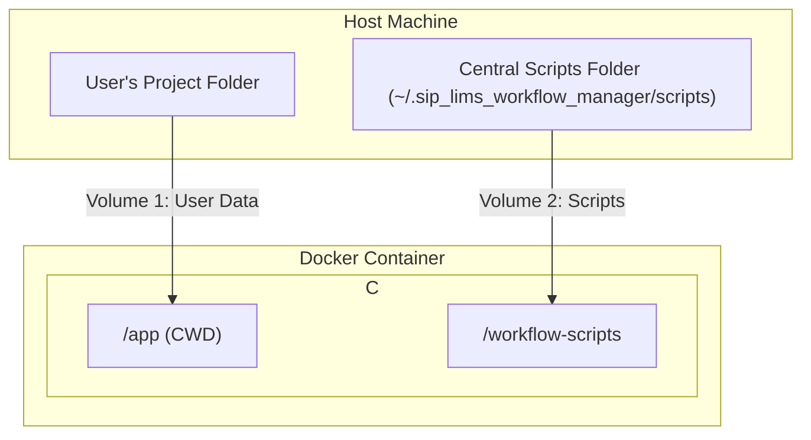

# The "Two-Volume" Docker Architecture

**Document Purpose:** This document provides a focused overview of the "Two-Volume" Docker architecture for the SIP LIMS Workflow Manager. It explains how this structure enables the separation of the application, user data, and workflow scripts.

For a complete discussion of the overall distribution and update strategy (including the "Public Repository Model"), please see `DISTRIBUTION_AND_UPDATE_STRATEGY.md`.

---

## 1. Core Concept: Separation of Concerns

The architecture is designed to satisfy three core requirements:

1.  **A Stable, Containerized Application:** The core application runs within a Docker container for a consistent, cross-platform runtime environment.
2.  **Independent, Updatable Scripts:** A separate repository of workflow scripts can be updated via `git` without rebuilding the application's Docker image.
3.  **Isolated User Data:** The user's project data remains in a user-chosen location on their host machine.

The "Two-Volume" approach is the accepted solution that meets all three requirements by correctly isolating these components.

## 2. The Architecture

The system is composed of three distinct parts, linked by Docker volume mounts.

*   **The Application Image:** A self-contained Docker image holding the Streamlit application code (`app.py`, `src/`, etc.) and the Conda environment. The `scripts` are **not** part of this image.
*   **Volume 1 (User Project Data):**
    *   **Host Path:** A user-selected project folder (e.g., `~/Desktop/Project_A`).
    *   **Container Path:** `/app` (This becomes the container's working directory).
*   **Volume 2 (Workflow Scripts):**
    *   **Host Path:** A standardized, central folder on the host machine: `~/.sip_lims_workflow_manager/scripts`.
    *   **Container Path:** `/workflow-scripts`.

### Architecture Diagram

## 4. The Complete End-to-End User and Data Flow

This section details the entire lifecycle, from first-time setup to routine use.

### Step 1: Distribution & First-Time Setup

1.  **Download:** The user downloads a `.zip` file of the `sip_lims_workflow_manager` repository. This `.zip` file **does not** contain the `scripts` folder.
2.  **Build Image:** The user runs a `setup_docker` script, which builds the application's Docker image from the `Dockerfile`.
3.  **First Run:** The user executes the `run.command` or `run.bat` script.
4.  **Automatic Script Cloning:** On first run, the application checks if the central scripts folder (`~/.sip_lims_workflow_manager/scripts`) exists on the host. If not, it performs an anonymous `git clone` from the public repository URL to populate this directory. This is a one-time, automatic, authentication-free operation.

### Step 2: Normal Operation & Script Updates

1.  **Start Application:** On subsequent runs, the application sees that the central scripts folder exists and proceeds directly.
2.  **Run Workflow:** The application executes scripts by looking for them at the static `/workflow-scripts` path inside the container. It reads and writes user data to its working directory, `/app`, which is a live link to the user's project folder on the host.
3.  **Check for Updates:** The user clicks the "Check for Updates" button. The application runs `git fetch` on the `/workflow-scripts` directory, checking the status of the repository on the host machine against GitHub.
4.  **Perform Update:** The user clicks the "Update Scripts" button. The application runs `git pull` (or `git checkout`) on the `/workflow-scripts` directory.
5.  **Instant Availability:** Because this is a live volume mount, the files in `~/.sip_lims_workflow_manager/scripts` on the host are updated instantly. The running container immediately sees these changes. No Docker restart is required. The UI simply refreshes to reflect the new state.

This architecture provides a robust, flexible, and user-friendly system that meets all stated requirements.