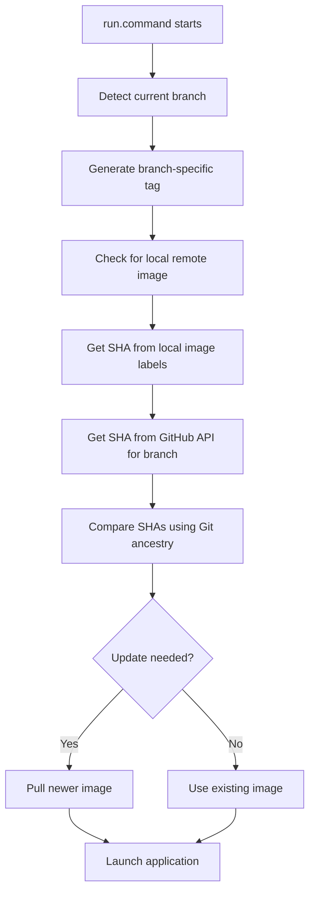

# Branch-Aware Docker Architecture

## Overview

The SIP LIMS Workflow Manager implements a branch-aware Docker system that automatically manages separate Docker images for different Git branches. This document explains the technical architecture and implementation details.

## Core Components

### 1. Branch Utilities (`utils/branch_utils.py` & `utils/branch_utils.sh`)

**Purpose**: Provide consistent branch detection and Docker image name generation across all scripts.

**Key Functions**:
- `get_current_branch()`: Detects current Git branch
- `sanitize_branch_for_docker_tag()`: Converts branch names to valid Docker tags
- `get_local_image_name_for_current_branch()`: Generates local image names
- `get_remote_image_name_for_current_branch()`: Generates remote image names

**Branch-to-Tag Conversion Rules**:
```python
# Examples:
"main" → "main"
"analysis/esp-docker-adaptation" → "analysis-esp-docker-adaptation"
"feature/new-analysis" → "feature-new-analysis"
"hotfix/bug-123" → "hotfix-bug-123"
```

**Implementation Details**:
- Converts to lowercase
- Replaces `/` with `-`
- Collapses multiple consecutive dashes
- Validates Git repository state

### 2. Enhanced Update Detector (`src/update_detector.py`)

**Purpose**: Compare local Docker images with remote Git commits to determine if updates are available.

**Key Enhancement**: Removed hardcoded `main` branch reference, now accepts branch parameter.

**Update Detection Logic**:
1. **Local SHA**: Extract from pulled remote image labels (`com.sip-lims.commit-sha`)
2. **Remote SHA**: Fetch from GitHub API for current branch
3. **Comparison**: Use Git ancestry and timestamp analysis to determine update availability

**Branch-Aware Methods**:
```python
def check_docker_update(self, tag: str = "latest", branch: Optional[str] = None):
    # Now accepts branch parameter for branch-aware detection
    
def get_remote_docker_image_commit_sha(self, tag: str = "latest", branch: Optional[str] = None):
    # Auto-detects branch if not provided
```

### 3. Enhanced Build Script (`build_image_from_lock_files.sh`)

**Purpose**: Build Docker images with branch-aware tagging and metadata.

**Key Enhancements**:
- Auto-detects current Git branch
- Generates branch-specific Docker tags
- Embeds commit SHA in image labels
- Creates images like: `sip-lims-workflow-manager:analysis-esp-docker-adaptation`

**Metadata Labels**:
```dockerfile
LABEL com.sip-lims.commit-sha="0ce04341c6b91a659cdf7fba2377ac7c2ff80760"
LABEL com.sip-lims.build-date="2025-12-22T22:37:18Z"
LABEL com.sip-lims.version="v3.0.0-23-g0ce0434"
LABEL org.opencontainers.image.revision="0ce04341c6b91a659cdf7fba2377ac7c2ff80760"
```

### 4. Enhanced Push Script (`push_image_to_github.sh`)

**Purpose**: Push branch-specific images to GitHub Container Registry.

**Key Enhancements**:
- Auto-detects current Git branch
- Tags local image with remote registry format
- Pushes to branch-specific registry locations
- Creates local tagged copy for update detection

**Docker Tagging Process**:
```bash
# Original local image
sip-lims-workflow-manager:analysis-esp-docker-adaptation

# Creates tagged copy (Line 66)
docker tag "$LOCAL_IMAGE_NAME" "$REMOTE_IMAGE_NAME"

# Result: Two local images with same Image ID
sip-lims-workflow-manager:analysis-esp-docker-adaptation
ghcr.io/rrmalmstrom/sip_lims_workflow_manager:analysis-esp-docker-adaptation
```

### 5. Enhanced Run Script (`run.command`)

**Purpose**: Automatically select and update branch-specific Docker images.

**Key Enhancement**: Fixed update detection to use branch-aware parameters instead of default `:latest` tag.

**Branch-Aware Update Detection**:
```bash
# OLD (broken):
local update_result=$(python3 src/update_detector.py --check-docker 2>/dev/null)

# NEW (branch-aware):
local update_result=$(python3 -c "
from src.update_detector import UpdateDetector
from utils.branch_utils import get_current_branch, sanitize_branch_for_docker_tag
import json

detector = UpdateDetector()
branch = get_current_branch()
tag = sanitize_branch_for_docker_tag(branch)

result = detector.check_docker_update(tag=tag, branch=branch)
print(json.dumps(result))
" 2>/dev/null)
```

## System Architecture

### Image Naming Convention

| Component | Format | Example |
|-----------|--------|---------|
| **Local Images** | `sip-lims-workflow-manager:<branch-tag>` | `sip-lims-workflow-manager:analysis-esp-docker-adaptation` |
| **Remote Images** | `ghcr.io/rrmalmstrom/sip_lims_workflow_manager:<branch-tag>` | `ghcr.io/rrmalmstrom/sip_lims_workflow_manager:analysis-esp-docker-adaptation` |

### Update Detection Flow



### Branch Isolation

Each Git branch maintains its own Docker ecosystem:

```
main branch:
├── Local: sip-lims-workflow-manager:main
└── Remote: ghcr.io/.../sip_lims_workflow_manager:main

analysis/esp-docker-adaptation branch:
├── Local: sip-lims-workflow-manager:analysis-esp-docker-adaptation
└── Remote: ghcr.io/.../sip_lims_workflow_manager:analysis-esp-docker-adaptation

feature/new-analysis branch:
├── Local: sip-lims-workflow-manager:feature-new-analysis
└── Remote: ghcr.io/.../sip_lims_workflow_manager:feature-new-analysis
```

## Implementation Details

### SHA-Based Update Detection

The system uses commit SHAs embedded in Docker image labels to determine update availability:

1. **Build Time**: Current Git commit SHA is embedded in image labels
2. **Update Check**: Compare local image SHA with remote Git commit SHA
3. **Decision**: Use Git ancestry to determine if update is needed

### Docker Tag Sanitization

Branch names are converted to valid Docker tags:

```python
def sanitize_branch_for_docker_tag(branch_name: str) -> str:
    """Convert branch name to valid Docker tag."""
    # Convert to lowercase
    tag = branch_name.lower()
    
    # Replace invalid characters
    tag = re.sub(r'[^a-z0-9._-]', '-', tag)
    
    # Collapse multiple dashes
    tag = re.sub(r'-+', '-', tag)
    
    # Remove leading/trailing dashes
    tag = tag.strip('-')
    
    return tag
```

### Error Handling

The system includes comprehensive error handling:

- **Git Repository Validation**: Ensures scripts run in valid Git repositories
- **Branch Detection Fallback**: Falls back to `main` if branch detection fails
- **Docker Availability**: Checks if Docker is running before operations
- **Image Existence**: Validates local images exist before pushing

### Testing Infrastructure

Comprehensive test suite with 51 passing tests:

- **Unit Tests**: Individual component testing
- **Integration Tests**: End-to-end workflow testing
- **Branch Utilities Tests**: 32 tests for branch detection and naming
- **Update Detector Tests**: 8 tests for branch-aware update detection
- **Real-World Validation**: Manual testing with actual Docker operations

## Benefits

### For Developers
- **Isolated Development**: Work on feature branches without affecting main
- **Automatic Management**: No manual Docker tag specification needed
- **Safe Experimentation**: Each branch has its own Docker images
- **Local Testing**: Test locally before pushing to remote

### For Users
- **Stable Images**: Main branch users get stable, tested images
- **Branch-Specific Updates**: Users on development branches get appropriate updates
- **Automatic Updates**: System automatically detects and applies updates

### For System
- **Deterministic Builds**: SHA-based versioning ensures reproducibility
- **Clear Separation**: Each branch maintains its own Docker ecosystem
- **Backward Compatibility**: Existing workflows continue to work
- **Industry Standard**: Follows standard Git branching and Docker practices

## Migration Notes

The branch-aware system is **backward compatible**:

- Existing `:latest` images continue to work
- Scripts auto-detect branches and generate appropriate tags
- No manual configuration required
- Gradual migration as branches are worked on

## Future Enhancements

Potential improvements:
- **Cleanup Scripts**: Automatic removal of old branch-specific images
- **Multi-Registry Support**: Support for additional container registries
- **Advanced Caching**: Improved Docker layer caching strategies
- **Monitoring**: Enhanced logging and monitoring of Docker operations