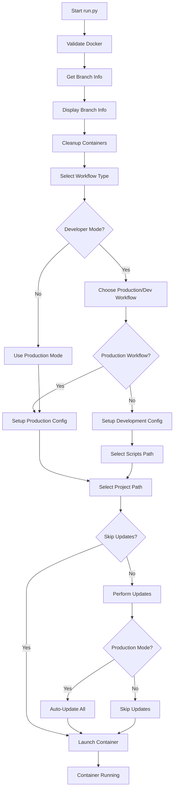

# run.py Architecture Analysis

**Document Purpose**: Comprehensive analysis of the [`run.py`](../../run.py) unified Docker launcher for future development agents.

**Analysis Date**: 2026-01-13  
**Script Version**: 1.0.0  
**Analyzed Lines**: 1-812

## Executive Summary

The [`run.py`](../../run.py) script is a unified, cross-platform Docker launcher that replaces platform-specific scripts (`run.mac.command`, `run.windows.bat`). It provides intelligent update management, environment detection, and robust container lifecycle management with a rich CLI interface.

## 1. Workflow Initialization Process

### Initialization Sequence

The workflow follows a strict initialization sequence in [`DockerLauncher.launch()`](../../run.py:672-719):

1. **Environment Validation** ([`validate_environment()`](../../run.py:606-614))
   - Validates Docker availability using [`PlatformAdapter.validate_docker()`](../../run.py:147-158)
   - Exits with error code 1 if Docker is not running
   - Uses `docker info` command with 10-second timeout

2. **Branch Information Setup** ([`DockerLauncher.__init__()`](../../run.py:591-604))
   - Initializes branch info using [`get_branch_info()`](../../run.py:597) from `utils.branch_utils`
   - Creates [`ContainerManager`](../../run.py:603) and [`UpdateManager`](../../run.py:604) instances
   - Handles [`GitRepositoryError`](../../run.py:598) and [`BranchDetectionError`](../../run.py:598) exceptions

3. **Container Cleanup** ([`cleanup_existing_containers()`](../../run.py:308-346))
   - Finds containers using workflow manager images via Docker filters
   - Stops and removes existing containers to prevent conflicts
   - Uses both local and remote image names for comprehensive cleanup

4. **Interactive Configuration**
   - Workflow type selection ([`select_workflow_type()`](../../run.py:191-208))
   - Mode detection and configuration ([`handle_mode_selection()`](../../run.py:630-646))
   - Project path selection ([`select_project_path()`](../../run.py:211-237))

### Key Classes and Their Responsibilities

- **[`DockerLauncher`](../../run.py:588-719)**: Main orchestrator class
- **[`PlatformAdapter`](../../run.py:119-184)**: Cross-platform compatibility layer
- **[`UserInterface`](../../run.py:187-296)**: Rich CLI interaction using Click library
- **[`ContainerManager`](../../run.py:299-397)**: Docker container lifecycle management
- **[`UpdateManager`](../../run.py:400-585)**: Update detection and execution

## 2. Developer vs Production Environment Detection

### Detection Mechanism

The script uses a **marker file approach** for environment detection:

```python
# Located in DockerLauncher.detect_mode() (line 625-628)
developer_marker = self.project_root / "config" / "developer.marker"
return "developer" if developer_marker.exists() else "production"
```

### Mode Handling Logic

**[`handle_mode_selection()`](../../run.py:630-646)** implements the decision tree:

- **Developer Mode Detected**: 
  - Presents choice via [`UserInterface.choose_developer_mode()`](../../run.py:269-288)
  - Option 1: Production workflow (auto-updates enabled)
  - Option 2: Development workflow (local scripts, no auto-updates)

- **Production Mode**: 
  - Automatically uses production workflow with auto-updates
  - No user interaction required

### Configuration Setup

- **Production Mode** ([`setup_production_mode()`](../../run.py:648-660)):
  - Scripts directory: `~/.sip_lims_workflow_manager/{workflow_type}_scripts`
  - App environment: `"production"`
  - Docker image: Remote image from branch info

- **Development Mode** ([`setup_development_mode()`](../../run.py:662-670)):
  - Scripts directory: User-selected via [`select_scripts_path()`](../../run.py:240-266)
  - App environment: `"development"`
  - Docker image: Local image from branch info

## 3. Remote Repository Checking Mechanisms

### Repository Update Detection

Repository updates are handled in [`UpdateManager.check_repository_updates()`](../../run.py:443-491):

#### 1. Branch Detection and Remote Sync
```bash
# Get current branch
git branch --show-current

# Fetch latest remote information
git fetch origin
```

#### 2. Update Detection Algorithm
```bash
# Count commits behind remote
git rev-list --count HEAD..origin/{current_branch}

# Check for local uncommitted changes
git diff-index --quiet HEAD --
```

#### 3. Conflict Prevention Strategy
- **Local Changes Check**: Uses `git diff-index --quiet HEAD --`
- **Conflict Handling**: Skips update if local uncommitted changes exist
- **User Guidance**: Warns user to commit/stash changes manually
- **Safety First**: Never forces updates that could lose local work

#### 4. Update Execution
```bash
# Safe pull operation
git pull origin {current_branch}
```

### Error Handling
- **Subprocess Errors**: Caught as [`subprocess.CalledProcessError`](../../run.py:490)
- **Warning Display**: Uses yellow colored output for non-fatal issues
- **Graceful Degradation**: Continues execution even if repository check fails

## 4. Update Application Timing and Methods

### Update Management Architecture

Updates are orchestrated by the [`UpdateManager`](../../run.py:400-585) class with mode-specific behaviors:

#### Production Mode Auto-Updates

**[`production_auto_update()`](../../run.py:414-428)** executes in sequence:

1. **Fatal Sync Check** ([`check_fatal_sync_errors()`](../../run.py:430-441))
   - Calls [`check_fatal_sync_errors()`](../../run.py:434) from `src.fatal_sync_checker`
   - Stops execution on fatal repository/Docker sync errors
   - Returns exit code 0 for success, non-zero for fatal errors

2. **Repository Updates** ([`check_repository_updates()`](../../run.py:443-491))
   - Detailed in section 3 above
   - Handles workflow manager repository updates

3. **Docker Image Updates** ([`check_docker_updates()`](../../run.py:493-515))
   - Uses [`UpdateDetector.check_docker_update()`](../../run.py:498-501)
   - Handles chronology uncertainty warnings
   - Performs image cleanup before pulling new versions

4. **Scripts Updates** ([`check_scripts_updates()`](../../run.py:565-585))
   - Uses [`ScriptsUpdater`](../../run.py:570) for workflow-specific scripts
   - Updates centralized scripts in production mode

#### Development Mode Behavior
- **Skip All Updates** ([line 412](../../run.py:412)): `"Development mode - skipping auto-updates"`
- **Local Resources**: Uses local scripts and Docker images
- **No Network Calls**: Avoids remote repository or Docker registry checks

#### Update Timing
- **Pre-Launch**: Updates occur **before container launch** ([line 708-709](../../run.py:708-709))
- **CLI Override**: Can be skipped with `--no-updates` flag ([line 772](../../run.py:772))
- **Interactive Control**: User can control update behavior through CLI arguments

### Docker Update Handling

#### Chronology Uncertainty Management

**[`handle_chronology_warning()`](../../run.py:517-533)** addresses Docker image versioning issues:

- **Warning Display**: Shows chronology uncertainty details
- **User Confirmation**: Requires explicit user approval for uncertain updates
- **Safety Mechanism**: Prevents accidental downgrades
- **Default Behavior**: Defaults to "No" for safety

#### Docker Update Process

**[`perform_docker_update()`](../../run.py:535-563)** implements safe update strategy:

1. **Image ID Capture**: Gets current image ID for cleanup
2. **Cleanup First**: Removes old image before pulling new one
3. **Image Pruning**: Runs `docker image prune -f` for space management
4. **New Image Pull**: Pulls latest image from remote registry
5. **Error Handling**: Comprehensive error handling with meaningful messages

## 5. Overall Flow and Decision Points

### Main Execution Flow



### Critical Decision Points

1. **Mode Detection** ([line 627](../../run.py:627))
   - **Trigger**: `config/developer.marker` file existence
   - **Impact**: Determines entire workflow behavior
   - **Fallback**: Defaults to production mode if marker absent

2. **Developer Workflow Choice** ([line 635](../../run.py:635))
   - **Trigger**: Developer mode detected
   - **Options**: Production workflow vs Development workflow
   - **Impact**: Controls update behavior and resource selection

3. **Update Execution Decision** ([line 409](../../run.py:409))
   - **Trigger**: `app_env` configuration value
   - **Logic**: `"production"` enables auto-updates, `"development"` skips
   - **Override**: `--no-updates` CLI flag can skip regardless of mode

4. **Docker Image Selection** 
   - **Production**: Remote image ([line 659](../../run.py:659))
   - **Development**: Local image ([line 669](../../run.py:669))
   - **Impact**: Determines which Docker image is used for container launch

5. **Chronology Warning Handling** ([line 504-506](../../run.py:504-506))
   - **Trigger**: Uncertain Docker image chronology
   - **Behavior**: Requires user confirmation
   - **Safety**: Prevents accidental downgrades

### Error Handling Strategy

- **Docker Unavailable**: Immediate exit with clear error message
- **Git Repository Issues**: Graceful degradation with warnings
- **Update Failures**: Continue execution with warnings
- **User Interruption**: Clean shutdown with appropriate messages
- **Fatal Sync Errors**: Immediate stop to prevent data corruption

## 6. Integration Points and Dependencies

### External Module Dependencies

The script integrates with existing infrastructure modules:

- **[`utils.branch_utils`](../../run.py:105-108)**: Branch detection and Docker tag management
  - [`get_current_branch()`](../../run.py:106)
  - [`get_docker_tag_for_current_branch()`](../../run.py:106)
  - [`get_local_image_name_for_current_branch()`](../../run.py:107)
  - [`get_remote_image_name_for_current_branch()`](../../run.py:107)
  - [`get_branch_info()`](../../run.py:108)

- **[`src.update_detector.UpdateDetector`](../../run.py:110)**: Docker and repository update detection
  - [`check_docker_update()`](../../run.py:498) method

- **[`src.scripts_updater.ScriptsUpdater`](../../run.py:111)**: Workflow-specific script management
  - [`check_scripts_update()`](../../run.py:571) method
  - [`update_scripts()`](../../run.py:575) method

- **[`src.fatal_sync_checker`](../../run.py:112)**: Repository/Docker synchronization validation
  - [`check_fatal_sync_errors()`](../../run.py:434) function

### Platform Compatibility Layer

**[`PlatformAdapter`](../../run.py:119-184)** provides cross-platform abstractions:

- **Platform Detection** ([`get_platform()`](../../run.py:123-128)): Normalizes platform names
- **User ID Mapping** ([`get_user_ids()`](../../run.py:131-144)): Handles Windows vs Unix user ID differences
- **Docker Validation** ([`validate_docker()`](../../run.py:147-158)): Cross-platform Docker availability check
- **Path Normalization** ([`normalize_path()`](../../run.py:161-171)): Handles drag-and-drop and platform-specific path formats
- **Docker Compose Detection** ([`get_docker_compose_command()`](../../run.py:174-184)): Detects `docker compose` vs `docker-compose`

### CLI Interface Abstraction

**Click Library Integration** with graceful fallback:

- **Feature Detection** ([line 22-26](../../run.py:22-26)): Detects Click availability
- **Fallback Implementation** ([line 27-101](../../run.py:27-101)): Minimal Click-compatible interface using standard library
- **Consistent API**: Same interface regardless of Click availability

## 7. Configuration and Environment Variables

### Docker Container Environment

**[`ContainerManager.prepare_environment()`](../../run.py:375-389)** prepares container environment:

```python
env = {
    "PROJECT_PATH": str(project_path),
    "PROJECT_NAME": project_path.name,
    "SCRIPTS_PATH": mode_config["scripts_path"],
    "WORKFLOW_TYPE": workflow_type,
    "APP_ENV": mode_config["app_env"],
    "DOCKER_IMAGE": mode_config["docker_image"],
    **user_ids  # USER_ID and GROUP_ID from PlatformAdapter
}
```

### Platform-Specific User ID Handling

- **Windows**: Uses environment variables or defaults (1000:1000)
- **Unix-like**: Uses actual `os.getuid()` and `os.getgid()`

## 8. Future Development Considerations

### Extensibility Points

1. **New Workflow Types**: Add to [`UserInterface.select_workflow_type()`](../../run.py:191-208)
2. **Additional Update Sources**: Extend [`UpdateManager`](../../run.py:400-585) class
3. **Platform-Specific Features**: Extend [`PlatformAdapter`](../../run.py:119-184) class
4. **CLI Options**: Add to argument parser ([`create_argument_parser()`](../../run.py:722-743))

### Refactoring Opportunities

1. **Configuration Management**: Consider centralizing configuration logic
2. **Update Strategy**: Could be made pluggable for different update sources
3. **Error Handling**: Could be standardized across all components
4. **Logging**: Could be enhanced with structured logging

### Testing Considerations

The script has been comprehensively tested across:
- Syntax validation and import testing
- Platform detection and cross-platform compatibility
- Git integration and branch detection
- Docker command detection and container management
- User interface and CLI argument parsing
- Module integration with existing update system
- Error handling and edge cases
- Real-world Docker container launch validation

## 9. Security Considerations

### Input Validation
- **Path Normalization**: Prevents path traversal attacks
- **Docker Command Validation**: Uses subprocess with explicit commands
- **Git Command Safety**: Uses specific git commands with controlled parameters

### Privilege Management
- **User ID Mapping**: Proper container user mapping
- **No Privilege Escalation**: Runs with user privileges
- **Docker Socket Access**: Relies on user's Docker permissions

## 10. Performance Characteristics

### Startup Time
- **Fast Path**: Development mode skips all network operations
- **Network Dependent**: Production mode depends on git fetch and docker pull speeds
- **Caching**: Docker layer caching improves subsequent runs

### Resource Usage
- **Memory**: Minimal Python script footprint
- **Network**: Only during update checks in production mode
- **Disk**: Docker image storage managed by Docker daemon

---

**Document Maintenance**: This analysis should be updated when significant changes are made to [`run.py`](../../run.py). Key areas to monitor:
- Update detection logic changes
- New platform support
- Additional workflow types
- CLI interface modifications
- Integration with new modules