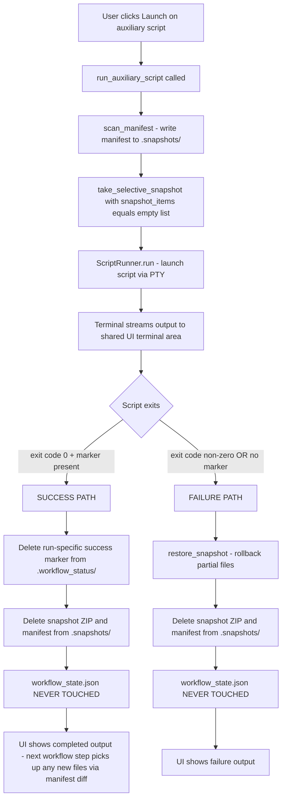

# Auxiliary Scripts Feature — Implementation Plan

## Summary

Add a new **Auxiliary Tools** section to the GUI below the main workflow steps. Auxiliary scripts can be launched at any time regardless of workflow state. Their success or failure **never modifies `workflow_state.json`** — not even temporarily. On failure, automatic rollback fires. On success, all temporary artifacts (snapshot, manifest, success marker) are deleted, leaving no trace in the workflow tracking system.

---

## Decisions Made

| Dimension | Decision |
|---|---|
| Declaration | `auxiliary_scripts` key inside each workflow YAML (same file as `steps`) |
| YAML schema | Same fields as workflow steps: `id`, `name`, `script` |
| Script location | Same `scripts/` directory as workflow scripts |
| GUI placement | Always-visible section below workflow steps, clear visual separator |
| Terminal output | Shared terminal area at top of page (same as workflow steps) |
| Concurrency | Mutually exclusive with workflow steps — one script at a time |
| Snapshot | Empty `snapshot_items=[]` + manifest (same pattern as skipped steps) |
| Success marker | Required — same two-factor check as workflow steps (exit code 0 + marker file) |
| On success | Delete snapshot, manifest, and success marker. `workflow_state.json` never touched. |
| On failure | Automatic rollback from snapshot. `workflow_state.json` never touched. |
| Branch | `feature/auxiliary-scripts` |

---

## Critical Invariant

**`workflow_state.json` is never read, written, or modified during an auxiliary script run.** The auxiliary system does not call `update_state()`, `state_manager.load()`, or `state_manager.save()` at any point. The JSON file is captured passively in the manifest scan (as part of the full project folder), but is never changed.

---

## How the Snapshot Chain Is Preserved

When an auxiliary script runs successfully and its snapshot/manifest are deleted, the `prev_manifest_path` used by the **next workflow step** still points to the last *workflow* step's manifest (not the auxiliary script's, which was deleted). The chain is unbroken.

Any output files created by a successful auxiliary script will be picked up by the next workflow step's manifest diff as "newly added by user" and included in that step's snapshot automatically.

---

## YAML Schema

Add an `auxiliary_scripts` top-level key to each workflow YAML, after the `steps` list:

```yaml
# Example — append to templates/sip_workflow.yml
auxiliary_scripts:
  - id: aux_example_tool
    name: "Example Auxiliary Tool"
    script: "example_auxiliary_tool.py"
```

**Auxiliary scripts must write a `<script_stem>.success` marker file** (same contract as workflow scripts) for the two-factor success check to work. The marker is written to `.workflow_status/<script_stem>.success` inside the project folder.

---

## Files to Change

### 1. `templates/sip_workflow.yml`
Append an `auxiliary_scripts:` section at the bottom of the file. Add at least one placeholder entry so the section is non-empty and testable.

### 2. `templates/sps_workflow.yml`
Same — append `auxiliary_scripts:` section.

### 3. `templates/CapsuleSorting_workflow.yml`
Same — append `auxiliary_scripts:` section.

### 4. `src/core.py` — `Workflow` class

In `__init__`, parse `auxiliary_scripts` from the YAML data alongside `steps`:

```python
self.auxiliary_scripts: List[Dict[str, Any]] = self._data.get("auxiliary_scripts", [])
```

Add a lookup method (mirrors `get_step_by_id`):

```python
def get_auxiliary_script_by_id(self, aux_id: str) -> Dict[str, Any]:
    """Finds an auxiliary script entry by its ID."""
    for aux in self.auxiliary_scripts:
        if aux.get("id") == aux_id:
            return aux
    return None
```

### 5. `src/core.py` — `Project` class

Add two new methods: `run_auxiliary_script` and `handle_auxiliary_result`.

#### `run_auxiliary_script(aux_id: str)`

```python
def run_auxiliary_script(self, aux_id: str):
    """
    Starts an auxiliary script asynchronously.
    - Takes a manifest + empty selective snapshot (for rollback on failure).
    - Does NOT read or write workflow_state.json.
    - Does NOT require SNAPSHOT_ITEMS in the script.
    - Uses aux_id as the snapshot key (so snapshot files are named
      e.g. aux_example_tool_run_1_manifest.json).
    """
    aux = self.workflow.get_auxiliary_script_by_id(aux_id)
    if not aux:
        raise ValueError(f"Auxiliary script '{aux_id}' not found in workflow.")

    script_filename = Path(aux["script"]).name
    script_full_path = self.script_path / script_filename

    if not script_full_path.exists():
        raise FileNotFoundError(f"Auxiliary script not found: {script_full_path}")

    # Always run_number=1 for auxiliary scripts (no rerun tracking)
    run_number = 1

    # Write manifest and take empty selective snapshot (snapshot_items=[])
    # This is the same pattern used by skip_to_step() for skipped steps.
    manifest_path, current_scan = self.snapshot_manager.scan_manifest(aux_id, run_number)
    self.snapshot_manager.take_selective_snapshot(
        aux_id, run_number,
        snapshot_items=[],
        prev_manifest_path=None,   # no previous manifest needed for aux scripts
        current_scan=current_scan,
    )

    # Launch the script — no args for auxiliary scripts
    self.script_runner.run(aux["script"], args=[])
```

#### `handle_auxiliary_result(aux_id: str, result: RunResult)`

```python
def handle_auxiliary_result(self, aux_id: str, result: RunResult):
    """
    Handles the result of an auxiliary script.
    - On success: deletes snapshot, manifest, and success marker.
      workflow_state.json is NEVER modified.
    - On failure: rolls back from snapshot, then deletes snapshot + manifest.
      workflow_state.json is NEVER modified.
    """
    aux = self.workflow.get_auxiliary_script_by_id(aux_id)
    if not aux:
        raise ValueError(f"Auxiliary script '{aux_id}' not found in workflow.")

    script_name = aux.get("script", "")
    run_number = 1  # auxiliary scripts always use run_number=1

    # --- Rename flat marker → run-specific marker (same as handle_step_result) ---
    if script_name:
        script_stem = Path(script_name).stem
        status_dir = self.path / ".workflow_status"
        flat_marker = status_dir / f"{script_stem}.success"
        run_marker = status_dir / f"{script_stem}.run_{run_number}.success"
        if flat_marker.exists():
            try:
                flat_marker.rename(run_marker)
            except OSError:
                pass

    # --- Two-factor success check (same as handle_step_result) ---
    exit_code_success = result.success
    marker_file_success = self._check_success_marker(script_name, run_number)
    actual_success = exit_code_success and marker_file_success

    if actual_success:
        # SUCCESS: clean up all temporary artifacts, leave no trace
        # 1. Delete the run-specific success marker
        if script_name:
            script_stem = Path(script_name).stem
            status_dir = self.path / ".workflow_status"
            run_marker = status_dir / f"{script_stem}.run_{run_number}.success"
            if run_marker.exists():
                run_marker.unlink()

        # 2. Delete the snapshot ZIP and manifest
        self.snapshot_manager.remove_all_run_snapshots(aux_id)
        # Also remove the manifest file directly
        manifest_path = (self.snapshot_manager.snapshots_dir /
                         f"{aux_id}_run_{run_number}_manifest.json")
        if manifest_path.exists():
            manifest_path.unlink()

        # workflow_state.json is NOT touched — this is intentional.

    else:
        # FAILURE: rollback from snapshot, then clean up
        if self.snapshot_manager.snapshot_exists(aux_id, run_number):
            # restore_snapshot raises RollbackError on failure — let it propagate
            self.snapshot_manager.restore_snapshot(aux_id, run_number)
            self.snapshot_manager.remove_run_snapshots_from(aux_id, run_number)

        # Clean up manifest
        manifest_path = (self.snapshot_manager.snapshots_dir /
                         f"{aux_id}_run_{run_number}_manifest.json")
        if manifest_path.exists():
            manifest_path.unlink()

        # Clean up any stale marker files
        if script_name:
            script_stem = Path(script_name).stem
            status_dir = self.path / ".workflow_status"
            for marker in [
                status_dir / f"{script_stem}.success",
                status_dir / f"{script_stem}.run_{run_number}.success",
            ]:
                if marker.exists():
                    marker.unlink()

        # workflow_state.json is NOT touched — this is intentional.
```

---

### 6. `app.py` — Session state initialization

In the `main()` function, in the "State Initialization" block (around line 533), add:

```python
if 'running_auxiliary_id' not in st.session_state:
    st.session_state.running_auxiliary_id = None
```

---

### 7. `app.py` — Terminal display block

The existing terminal display block (around line 1125) checks `st.session_state.running_step_id`. Extend the `elif` chain so that when `running_auxiliary_id` is set, the same terminal area is shown with an appropriate header:

```python
# Existing block:
if st.session_state.running_step_id:
    # ... existing workflow step terminal display ...

# Add this new elif:
elif st.session_state.running_auxiliary_id:
    aux_id = st.session_state.running_auxiliary_id
    aux_script = project.workflow.get_auxiliary_script_by_id(aux_id)
    st.markdown("# 🖥️ LIVE TERMINAL")
    st.warning(f"⏳ **AUXILIARY SCRIPT RUNNING**: {aux_script['name'] if aux_script else aux_id}")
    st.subheader("Terminal Output")
    if st.session_state.terminal_output:
        st.code(st.session_state.terminal_output, language=None)
    else:
        st.text("Waiting for script output...")
    # Terminate button (same as workflow steps)
    if st.button("🛑 Terminate", key="terminate_auxiliary_script", type="secondary"):
        project.script_runner.terminate()
        # Rollback from snapshot
        try:
            if project.snapshot_manager.snapshot_exists(aux_id, 1):
                project.snapshot_manager.restore_snapshot(aux_id, 1)
                project.snapshot_manager.remove_run_snapshots_from(aux_id, 1)
        except RollbackError as rollback_err:
            st.session_state.critical_rollback_alert = {
                "context": "terminate",
                "step_id": aux_id,
                "run_number": 1,
                "reason": rollback_err.reason,
            }
        st.session_state.running_auxiliary_id = None
        st.session_state.terminal_output = ""
        st.rerun()

# Existing elif for completed script output:
elif st.session_state.completed_script_output and st.session_state.completed_script_step:
    # ... existing completed output display (unchanged) ...
```

---

### 8. `app.py` — Auxiliary Tools UI section

After the workflow steps loop ends (after the final `st.markdown("---")` at line 1389), add the Auxiliary Tools section:

```python
# --- Auxiliary Tools Section ---
aux_scripts = project.workflow.auxiliary_scripts
if aux_scripts:
    st.markdown("## 🔧 Auxiliary Tools")
    st.caption("These scripts can be run at any time and do not affect the workflow state.")
    st.markdown("---")

    for aux in aux_scripts:
        aux_id = aux['id']
        aux_name = aux['name']
        is_running_this_aux = st.session_state.running_auxiliary_id == aux_id

        col1, col2 = st.columns([4, 1])
        with col1:
            if is_running_this_aux:
                st.warning(f"⏳ {aux_name} (Running...)")
            else:
                st.info(f"🔧 {aux_name}")

        with col2:
            # Disable if any script (workflow or auxiliary) is currently running
            launch_disabled = (
                st.session_state.running_step_id is not None or
                st.session_state.running_auxiliary_id is not None
            )
            if st.button("Launch", key=f"aux_{aux_id}", disabled=launch_disabled):
                st.session_state.running_auxiliary_id = aux_id
                st.session_state.terminal_output = ""
                # Start in background thread (same pattern as workflow steps)
                thread = threading.Thread(
                    target=lambda: project.run_auxiliary_script(aux_id)
                )
                st.session_state['script_thread'] = thread
                thread.start()
                st.rerun()

        st.markdown("---")
```

---

### 9. `app.py` — Polling loop

The existing polling loop at the bottom of `main()` (around line 1392) checks `running_step_id`. Add a parallel branch for `running_auxiliary_id`:

```python
# Existing block (unchanged):
if st.session_state.running_step_id:
    # ... existing polling logic ...

# Add this new elif block:
elif st.session_state.running_auxiliary_id:
    runner = st.session_state.project.script_runner
    aux_id = st.session_state.running_auxiliary_id

    # Poll for output (same as workflow steps)
    output_received = False
    while True:
        try:
            output = runner.output_queue.get_nowait()
            if output is not None:
                st.session_state.terminal_output += output
                output_received = True
            else:
                break
        except queue.Empty:
            break

    if output_received:
        st.rerun()

    # Poll for final result
    try:
        result = runner.result_queue.get_nowait()

        # Handle the result — no workflow state changes
        try:
            st.session_state.project.handle_auxiliary_result(aux_id, result)
        except RollbackError as rollback_err:
            st.session_state.critical_rollback_alert = {
                "context": "auto_rollback",
                "step_id": aux_id,
                "run_number": 1,
                "reason": rollback_err.reason,
            }

        # Preserve terminal output for completed display
        aux_script = st.session_state.project.workflow.get_auxiliary_script_by_id(aux_id)
        actual_success = result.success  # simplified — no state to check
        st.session_state.completed_script_output = st.session_state.terminal_output
        st.session_state.completed_script_step = aux_id
        st.session_state.completed_script_success = actual_success

        st.session_state.running_auxiliary_id = None
        st.rerun()

    except queue.Empty:
        time.sleep(0.1)
        st.rerun()
```

---

### 10. `docs/developer_guide/ARCHITECTURE.md`

Add a new section "Auxiliary Tools" describing the feature, the YAML schema, the lifecycle (snapshot → run → cleanup on success / rollback on failure), and the invariant that `workflow_state.json` is never modified.

---

## Flow Diagram



---

## Branch Strategy

- Create `feature/auxiliary-scripts` from `main`
- All implementation work on this branch
- Merge back to `main` when satisfied with testing
