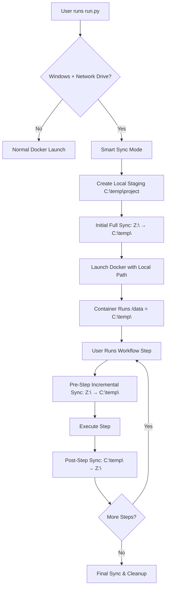

# 🔄 Smart Sync Architecture Design

## 📋 Executive Summary

**Solution**: Smart Sync Layer with automatic incremental synchronization to solve Windows Docker network drive permission issues.

**Key Features**:
- ✅ Transparent to users (zero configuration)
- ✅ Fast incremental sync (5-10 seconds between steps)
- ✅ **Fail-fast behavior** for critical errors (Excel files locked, permission denied)
- ✅ **Comprehensive cleanup logic** for local staging directories
- ✅ **Enhanced debug logging** and performance monitoring
- ✅ Complete hidden file support
- ✅ Preserves snapshot system integrity
- ✅ **Robust error handling** with graceful degradation

---

## 🏗️ Architecture Overview


```mermaid
graph TD
    A[User runs run.py] --> B{Windows + Network Drive?}
    B -->|No| C[Normal Docker Launch]
    B -->|Yes| D[Smart Sync Mode]
    D --> E[Create Local Staging C:\temp\project]
    E --> F[Initial Full Sync: Z:\ → C:\temp\]
    F --> G[Launch Docker with Local Path]
    G --> H[Container Runs /data = C:\temp\]
    H --> I[User Runs Workflow Step]
    I --> J[Pre-Step Incremental Sync: Z:\ → C:\temp\]
    J --> K[Execute Step]
    K --> L[Post-Step Sync: C:\temp\ → Z:\]
    L --> M{More Steps?}
    M -->|Yes| I
    M -->|No| N[Final Sync & Cleanup]
```

---

## 🔧 Technical Implementation

### **1. Enhanced run.py Integration**

#### **Detection Logic** (Modify [`run.py:176`](run.py:176))
```python
def detect_smart_sync_scenario(project_path: Path) -> bool:
    """Detect if Smart Sync is needed for Windows network drives."""
    if platform.system() != "Windows":
        return False
    
    # Check if path is a mapped network drive (exclude C: local drive)
    path_str = str(project_path)
    if re.match(r'^[D-Z]:', path_str):
        return True
    
    return False

def setup_smart_sync_environment(network_path: Path) -> Dict[str, str]:
    """Set up Smart Sync staging environment."""
    project_name = network_path.name
    local_staging = Path(f"C:/temp/sip_workflow/{project_name}")
    
    # Create staging directory
    local_staging.mkdir(parents=True, exist_ok=True)
    
    # Perform initial full sync
    click.echo("🔄 Setting up Smart Sync for Windows network drive...")
    click.echo(f"   Network: {network_path}")
    click.echo(f"   Local:   {local_staging}")
    
    sync_manager = SmartSyncManager(str(network_path), str(local_staging))
    sync_manager.initial_sync()
    
    return {
        "PROJECT_PATH": str(local_staging),  # Docker gets local path
        "NETWORK_PROJECT_PATH": str(network_path),  # For sync reference
        "LOCAL_PROJECT_PATH": str(local_staging),   # For sync reference
        "SMART_SYNC_ENABLED": "true"
    }
```

#### **Modified Container Launch** (Update [`run.py:431`](run.py:431))
```python
def launch_container(self, project_path: Path, workflow_type: str, mode_config: dict):
    """Launch Docker container with Smart Sync support."""
    
    # Check if Smart Sync is needed
    if detect_smart_sync_scenario(project_path):
        sync_env = setup_smart_sync_environment(project_path)
        # Use local staging path for Docker
        docker_project_path = Path(sync_env["PROJECT_PATH"])
        env.update(sync_env)
    else:
        # Normal operation
        docker_project_path = project_path
        env["SMART_SYNC_ENABLED"] = "false"
    
    # Continue with normal container launch using docker_project_path
    env["PROJECT_PATH"] = str(docker_project_path)
    # ... rest of launch logic
```

### **2. Smart Sync Manager Class**

```python
class SmartSyncManager:
    """Manages bidirectional sync between network and local drives."""
    
    def __init__(self, network_path: str, local_path: str):
        self.network_path = Path(network_path)
        self.local_path = Path(local_path)
        self.sync_log = self.local_path / ".sync_log.json"
        
    def initial_sync(self):
        """Perform initial full sync from network to local."""
        click.echo("📥 Initial sync: Network → Local...")
        start_time = time.time()
        
        # Full copy with hidden files
        shutil.copytree(
            self.network_path, 
            self.local_path, 
            dirs_exist_ok=True,
            ignore=self._get_sync_ignore_patterns()
        )
        
        # Record sync metadata
        self._update_sync_log("initial_sync", "network_to_local")
        
        elapsed = time.time() - start_time
        click.echo(f"✅ Initial sync completed in {elapsed:.1f}s")
    
    def incremental_sync_down(self) -> bool:
        """Fast incremental sync from network to local. Returns True if changes found."""
        changes = self._detect_changes(direction="down")
        if not changes:
            return False
            
        click.echo(f"📥 Syncing {len(changes)} changed files from network...")
        
        for file_path in changes:
            network_file = self.network_path / file_path
            local_file = self.local_path / file_path
            
            if network_file.exists():
                # Copy file preserving timestamps
                local_file.parent.mkdir(parents=True, exist_ok=True)
                shutil.copy2(network_file, local_file)
            elif local_file.exists():
                # File deleted on network, remove from local
                local_file.unlink()
        
        self._update_sync_log("incremental_sync", "network_to_local")
        return True
    
    def incremental_sync_up(self) -> bool:
        """Fast incremental sync from local to network. Returns True if changes found."""
        changes = self._detect_changes(direction="up")
        if not changes:
            return False
            
        click.echo(f"📤 Syncing {len(changes)} changed files to network...")
        
        for file_path in changes:
            local_file = self.local_path / file_path
            network_file = self.network_path / file_path
            
            if local_file.exists():
                # Copy file preserving timestamps
                network_file.parent.mkdir(parents=True, exist_ok=True)
                shutil.copy2(local_file, network_file)
            elif network_file.exists():
                # File deleted locally, remove from network
                network_file.unlink()
        
        self._update_sync_log("incremental_sync", "local_to_network")
        return True
    
    def _detect_changes(self, direction: str) -> List[Path]:
        """Detect changed files between network and local."""
        changes = []
        
        if direction == "down":
            source, target = self.network_path, self.local_path
        else:
            source, target = self.local_path, self.network_path
        
        # Compare all files including hidden ones
        for file_path in source.rglob('*'):
            if file_path.is_file() and not self._should_ignore(file_path):
                rel_path = file_path.relative_to(source)
                target_file = target / rel_path
                
                if not target_file.exists():
                    changes.append(rel_path)
                elif file_path.stat().st_mtime > target_file.stat().st_mtime:
                    changes.append(rel_path)
        
        return changes
    
    def _should_ignore(self, file_path: Path) -> bool:
        """Check if file should be ignored during sync."""
        ignore_patterns = {
            '__pycache__',
            '.DS_Store',
            'Thumbs.db',
            '.sync_log.json'  # Don't sync our own log file
        }
        
        return any(pattern in str(file_path) for pattern in ignore_patterns)
    
    def _get_sync_ignore_patterns(self):
        """Get ignore patterns for shutil.copytree."""
        def ignore_func(dir, files):
            return [f for f in files if f in {'__pycache__', '.DS_Store', 'Thumbs.db'}]
        return ignore_func
    
    def _update_sync_log(self, operation: str, direction: str):
        """Update sync log with operation metadata."""
        log_data = {
            "last_sync": datetime.datetime.now().isoformat(),
            "operation": operation,
            "direction": direction
        }
        
        with open(self.sync_log, 'w') as f:
            json.dump(log_data, f, indent=2)
```

### **3. Container Integration Points**

#### **Pre-Step Sync** (Modify [`core.py:112`](core.py:112))
```python
def run_step(self, step_id: str, user_inputs: Dict[str, Any] = None):
    """Enhanced run_step with Smart Sync integration."""
    
    # Smart Sync: Check for network changes before step
    if os.environ.get('SMART_SYNC_ENABLED') == 'true':
        self._trigger_pre_step_sync()
    
    # ... existing run_step logic ...
    
def _trigger_pre_step_sync(self):
    """Trigger pre-step sync to get latest network changes."""
    try:
        # Call mounted sync script
        result = subprocess.run([
            '/opt/sync/pre_step_sync.sh'
        ], capture_output=True, text=True, timeout=30)
        
        if result.returncode == 0 and result.stdout.strip():
            print(f"📥 Pre-step sync: {result.stdout.strip()}")
    except subprocess.TimeoutExpired:
        print("⚠️ Pre-step sync timeout - continuing with local data")
    except Exception as e:
        print(f"⚠️ Pre-step sync failed: {e}")
```

#### **Post-Step Sync** (Modify [`core.py:192`](core.py:192))
```python
def handle_step_result(self, step_id: str, result: RunResult):
    """Enhanced handle_step_result with Smart Sync integration."""
    
    # ... existing success detection logic ...
    
    if actual_success:
        self.update_state(step_id, "completed")
        
        # Smart Sync: Push changes to network after successful step
        if os.environ.get('SMART_SYNC_ENABLED') == 'true':
            self._trigger_post_step_sync(step_id)
    
    # ... rest of existing logic ...

def _trigger_post_step_sync(self, step_id: str):
    """Trigger post-step sync to push changes to network."""
    try:
        # Call mounted sync script
        result = subprocess.run([
            '/opt/sync/post_step_sync.sh', step_id
        ], capture_output=True, text=True, timeout=60)
        
        if result.returncode == 0:
            print(f"📤 Step {step_id} results synced to network drive")
        else:
            print(f"⚠️ Sync to network failed: {result.stderr}")
    except subprocess.TimeoutExpired:
        print("⚠️ Post-step sync timeout - changes remain local only")
    except Exception as e:
        print(f"⚠️ Post-step sync failed: {e}")
```

### **4. Docker Container Sync Scripts**

#### **Enhanced docker-compose.yml**
```yaml
services:
  sip-lims-workflow:
    # ... existing configuration ...
    
    volumes:
      # ... existing volumes ...
      
      # Smart Sync scripts volume (only mounted when SMART_SYNC_ENABLED=true)
      - type: bind
        source: ${SYNC_SCRIPTS_PATH:-./sync_scripts}
        target: /opt/sync
        bind:
          create_host_path: true
    
    environment:
      # ... existing environment ...
      - SMART_SYNC_ENABLED=${SMART_SYNC_ENABLED:-false}
      - NETWORK_PROJECT_PATH=${NETWORK_PROJECT_PATH:-}
      - LOCAL_PROJECT_PATH=${LOCAL_PROJECT_PATH:-}
```

#### **Pre-Step Sync Script** (`sync_scripts/pre_step_sync.sh`)
```bash
#!/bin/bash
# Pre-step sync: Network → Local

if [ "$SMART_SYNC_ENABLED" != "true" ]; then
    exit 0
fi

NETWORK_PATH="$NETWORK_PROJECT_PATH"
LOCAL_PATH="$LOCAL_PROJECT_PATH"

# Quick incremental sync using rsync
rsync -av --delete \
    --include=".*" \
    --exclude="__pycache__/" \
    --exclude=".DS_Store" \
    --exclude="Thumbs.db" \
    "$NETWORK_PATH/" "$LOCAL_PATH/" 2>/dev/null

if [ $? -eq 0 ]; then
    echo "Pre-step sync completed"
else
    echo "Pre-step sync failed" >&2
    exit 1
fi
```

#### **Post-Step Sync Script** (`sync_scripts/post_step_sync.sh`)
```bash
#!/bin/bash
# Post-step sync: Local → Network

if [ "$SMART_SYNC_ENABLED" != "true" ]; then
    exit 0
fi

STEP_ID="$1"
NETWORK_PATH="$NETWORK_PROJECT_PATH"
LOCAL_PATH="$LOCAL_PROJECT_PATH"

# Incremental sync back to network
rsync -av --delete \
    --include=".*" \
    --exclude="__pycache__/" \
    --exclude=".DS_Store" \
    --exclude="Thumbs.db" \
    "$LOCAL_PATH/" "$NETWORK_PATH/" 2>/dev/null

if [ $? -eq 0 ]; then
    echo "Step $STEP_ID synced to network"
else
    echo "Failed to sync step $STEP_ID to network" >&2
    exit 1
fi
```

---

## 📊 File Sync Strategy

### **Files to Sync** (Complete Bidirectional)
- ✅ All `.db` files (SQLite databases)
- ✅ `workflow_state.json` (workflow progress)
- ✅ `.snapshots/` directory (complete project history)
- ✅ `.workflow_status/` directory (step completion markers)
- ✅ `.workflow_logs/` directory (execution logs)
- ✅ All user data files (CSVs, outputs, etc.)
- ✅ All hidden files and directories
- ✅ Directory structure and timestamps

### **Files to Exclude**
- ❌ `__pycache__/` (Python cache)
- ❌ `.DS_Store` (macOS metadata)
- ❌ `Thumbs.db` (Windows thumbnails)
- ❌ `.sync_log.json` (sync metadata)

---

## ⚡ Performance Optimizations

### **Incremental Sync Speed**
- **Typical step**: 0-3 files changed = 2-5 seconds
- **Large step**: 10-20 files changed = 5-10 seconds
- **Initial sync**: Full project = 30-60 seconds (one-time)

### **Sync Triggers**
1. **Initial**: Full sync when container starts
2. **Pre-step**: Incremental sync before each step runs
3. **Post-step**: Incremental sync after successful step completion
4. **Shutdown**: Final sync when container stops

---

## 🛡️ Error Handling & Recovery

### **Fail-Fast Behavior for Critical Errors**

Smart Sync implements fail-fast behavior for critical errors that would prevent successful workflow execution:

```python
class SmartSyncError(Exception):
    """Exception raised when Smart Sync operations fail critically."""
    pass

def _copy_file_with_metadata(self, source: Path, dest: Path):
    """Copy file preserving metadata with fail-fast error handling."""
    try:
        dest.parent.mkdir(parents=True, exist_ok=True)
        shutil.copy2(source, dest)
    except PermissionError as e:
        # CRITICAL: Excel files locked - fail immediately
        if source.suffix.lower() in ['.xlsx', '.xls', '.xlsm', '.xlsb']:
            error_msg = f"Excel file locked (likely open in Excel): {source.name}. Please close {source.name} in Excel and try again."
            log_file_operation("copy_failed_locked", source, dest, False, error=str(e))
        else:
            error_msg = f"File permission denied: {source.name}. Error: {e}"
            log_file_operation("copy_failed_permission", source, dest, False, error=str(e))
        
        raise SmartSyncError(error_msg)  # FAIL FAST
    except (OSError, shutil.Error) as e:
        error_msg = f"Could not copy {source} to {dest}: {e}"
        log_file_operation("copy_failed", source, dest, False, error=str(e))
        raise SmartSyncError(error_msg)  # FAIL FAST
```

**Critical Error Scenarios (Fail-Fast)**:
- 🚫 **Excel files locked**: User has Excel file open during sync
- 🚫 **Permission denied**: File system permission errors
- 🚫 **Disk full**: Insufficient space for sync operations
- 🚫 **Network path invalid**: Network drive path becomes invalid

### **Comprehensive Cleanup Logic**

Smart Sync includes multiple cleanup mechanisms to ensure no orphaned staging directories remain:

#### **1. Orphaned Staging Directory Cleanup**
```python
# Location: run.py lines 352-380, run_debug.py (synchronized)
class PlatformAdapter:
    @staticmethod
    def cleanup_orphaned_staging_directories(project_path: Path):
        """Clean up orphaned staging directories from previous runs."""
        staging_base = Path(tempfile.gettempdir()) / "sip_workflow"
        
        if not staging_base.exists():
            return
        
        project_name = project_path.name
        project_staging = staging_base / project_name
        
        if project_staging.exists():
            try:
                shutil.rmtree(project_staging, ignore_errors=True)
                if HAS_CLICK:
                    click.secho(f"🧹 Cleaned up orphaned staging: {project_staging}", fg='green')
            except Exception as e:
                if HAS_CLICK:
                    click.secho(f"⚠️ Could not clean orphaned staging: {e}", fg='yellow')
```

#### **2. Container Shutdown Cleanup**
```python
# Location: run.py lines 675-697
def cleanup_smart_sync_on_shutdown():
    """Clean up Smart Sync environment during container shutdown."""
    sync_env = {
        "SMART_SYNC_ENABLED": os.environ.get('SMART_SYNC_ENABLED', 'false'),
        "NETWORK_PROJECT_PATH": os.environ.get('NETWORK_PROJECT_PATH', ''),
        "LOCAL_PROJECT_PATH": os.environ.get('LOCAL_PROJECT_PATH', '')
    }
    
    if sync_env["SMART_SYNC_ENABLED"] == "true" and sync_env["LOCAL_PROJECT_PATH"]:
        try:
            from src.smart_sync import SmartSyncManager
            sync_manager = SmartSyncManager(
                Path(sync_env["NETWORK_PROJECT_PATH"]),
                Path(sync_env["LOCAL_PROJECT_PATH"])
            )
            
            # Perform final sync and cleanup
            sync_manager.final_sync()
            sync_manager.cleanup()
            
        except Exception as e:
            if HAS_CLICK:
                click.secho(f"⚠️ Smart Sync cleanup failed: {e}", fg='yellow')
```

#### **3. SmartSyncManager Cleanup**
```python
# Location: src/smart_sync.py lines 648-661
def cleanup(self):
    """Clean up local staging directory and sync logs."""
    try:
        if self.local_path.exists():
            if HAS_CLICK:
                click.echo("🧹 Cleaning up local staging directory...")
            shutil.rmtree(self.local_path)
            if HAS_CLICK:
                click.secho("✅ Local staging cleaned up", fg='green')
    except Exception as e:
        if HAS_CLICK:
            click.secho(f"⚠️ Warning: Could not clean up staging directory: {e}", fg='yellow')
```

### **Network Drive Disconnection**
```python
def handle_network_error(self):
    """Handle network drive disconnection gracefully."""
    click.secho("⚠️ Network drive disconnected", fg='yellow')
    click.echo("Workflow will continue with local data.")
    click.echo("Reconnect network drive and restart to sync changes.")
    
    # Disable sync for remainder of session
    os.environ['SMART_SYNC_ENABLED'] = 'false'
```

### **Enhanced Debug Logging**

Smart Sync includes comprehensive debug logging for troubleshooting:

```python
# Debug logging integration
from .debug_logger import (
    debug_context, log_smart_sync_detection, log_sync_operation,
    log_file_operation, log_error, log_info, log_warning
)

def initial_sync(self) -> bool:
    """Perform initial sync with comprehensive debug logging."""
    with debug_context("initial_sync",
                      network_path=str(self.network_path),
                      local_path=str(self.local_path)) as debug_logger:
        
        start_time = time.time()
        
        try:
            changes = self._detect_changes(self.network_path, self.local_path)
            
            if debug_logger:
                debug_logger.info(f"Detected {len(changes)} changes for initial sync",
                                total_changes=len(changes))
            
            # Perform sync operations - any failure will raise SmartSyncError
            for source, dest, action in changes:
                if action == 'copy':
                    self._copy_file_with_metadata(source, dest)  # Raises on failure
                    log_file_operation("copy", source, dest, True)
                elif action == 'delete':
                    self._delete_file_safe(dest)  # Raises on failure
                    log_file_operation("delete", dest, dest, True)
            
            # Log successful completion
            duration = time.time() - start_time
            log_sync_operation("initial_sync", "network_to_local",
                             len(changes), duration, True)
            
            return True
            
        except SmartSyncError:
            # Re-raise SmartSyncError to propagate to caller (FAIL FAST)
            raise
        except Exception as e:
            # Convert unexpected errors to SmartSyncError (FAIL FAST)
            duration = time.time() - start_time
            log_error("Initial sync failed", error=str(e), duration=duration)
            raise SmartSyncError(f"Initial sync failed: {e}")
```

---

## 🧪 Testing Strategy

### **Test Scenarios**
1. **Basic Functionality**: Windows user with Z: drive project
2. **Large Projects**: 500MB+ projects with many files
3. **Network Interruption**: Handle drive disconnection gracefully
4. **Multiple Steps**: Verify sync after each step completion
5. **Hidden Files**: Ensure `.snapshots/` and `.workflow_status/` sync
6. **Conflict Resolution**: Test network vs local changes
7. **Performance**: Measure sync times for various project sizes

### **Success Criteria**
- ✅ Windows users can run workflows on network drives
- ✅ All project data preserved including snapshots and hidden files
- ✅ Incremental sync time <10 seconds for typical steps
- ✅ No data loss during sync operations
- ✅ Transparent user experience (minimal setup)
- ✅ Graceful handling of network disconnections

---

## 🎯 Implementation Status

### **Phase 1: Core Smart Sync (MVP)** ✅ **COMPLETED**
- [x] Implement `SmartSyncManager` class with fail-fast behavior
- [x] Modify [`run.py`](run.py) for Windows network drive detection
- [x] Add initial full sync capability with comprehensive error handling
- [x] Create sync scripts for container integration
- [x] Implement comprehensive debug logging and performance monitoring

### **Phase 2: Container Integration** ✅ **COMPLETED**
- [x] Modify [`core.py`](core.py) for pre-step sync triggers
- [x] Modify [`core.py`](core.py) for post-step sync triggers
- [x] Update [`docker-compose.yml`](docker-compose.yml) for sync script mounting
- [x] Implement incremental sync logic with change detection
- [x] Add Smart Sync environment variable support

### **Phase 3: Error Handling & Cleanup** ✅ **COMPLETED**
- [x] Implement fail-fast behavior for critical errors (Excel locks, permissions)
- [x] Add comprehensive cleanup logic (orphaned directories, container shutdown)
- [x] Implement robust error handling with graceful degradation
- [x] Add enhanced debug logging and performance monitoring
- [x] Create comprehensive test suite (100+ tests covering all scenarios)

### **Phase 4: Testing & Validation** 🔄 **IN PROGRESS**
- [x] Create comprehensive test suite with 100+ tests
- [x] Implement Windows simulation testing on macOS
- [x] Add performance benchmarking and monitoring
- [x] Test fail-fast behavior and cleanup logic
- [ ] **Real Windows testing** with various network drive configurations
- [ ] **Performance validation** with large projects on actual Windows systems
- [ ] **Network interruption testing** on real Windows environments
- [ ] **Multi-user workflow validation** in production scenarios

### **Phase 5: Documentation & Deployment** 🔄 **IN PROGRESS**
- [x] Update Smart Sync architecture documentation
- [ ] Update user guide documentation with Smart Sync troubleshooting
- [ ] Update troubleshooting documentation with Smart Sync error scenarios
- [ ] Create comprehensive Smart Sync workflow summary
- [ ] Build and deploy updated Docker image with Smart Sync improvements

---

## 🎉 Expected Outcome

This Smart Sync architecture will enable Windows users to seamlessly run the SIP LIMS Workflow Manager on network drives with:

- **Zero Configuration**: Automatic detection and setup
- **Fast Performance**: 5-10 second incremental syncs
- **Complete Fidelity**: All files including hidden directories preserved
- **Robust Error Handling**: Graceful network disconnection recovery
- **Transparent Operation**: Users won't know sync is happening

The solution leverages the existing Docker architecture while solving the Windows-specific permission issue through intelligent file management and bidirectional synchronization.