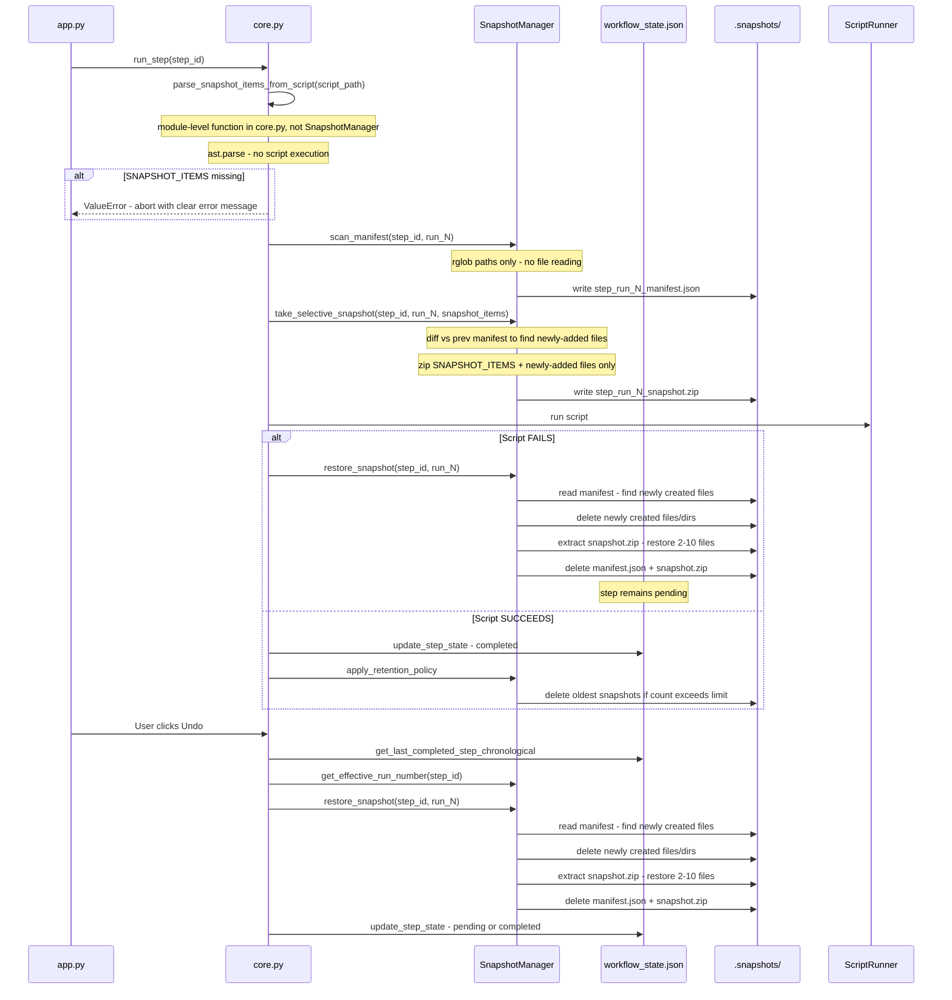

# Undo/Snapshot System Redesign

**Status:** Architectural Design — Approved for Implementation  
**Date:** 2026-04-13  
**Author:** Architectural Design Session  
**Replaces:** [`docs/archive/implementation_plans/simplified_undo_and_checkpoint_design.md`](../archive/implementation_plans/simplified_undo_and_checkpoint_design.md)

---

## 0. FA Archive Permanent Protection Rule

> **Scripts can touch FA archives. The undo system cannot.**

The three FA instrument archive subfolders are **permanently protected** from all undo and rollback operations:

```
archived_files/first_lib_attempt_fa_results/
archived_files/second_lib_attempt_fa_results/
archived_files/third_lib_attempt_fa_results/
```

These folders represent real laboratory work — raw instrument output files that must never be lost, regardless of how many times the user undoes steps or how far back they roll back. The rule is:

| Action | Effect on FA archive subfolders |
|---|---|
| Run an FA analysis step | Script replaces the relevant subfolder with new FA data ✅ |
| Re-run an FA analysis step | Script replaces it again with newer FA data ✅ |
| Undo any step (including FA analysis steps) | Folders stay exactly as-is — undo never removes or restores them |
| Automatic rollback of any failed step | Folders stay exactly as-is — rollback never removes or restores them |

**Implementation:** The undo system maintains a `PERMANENT_EXCLUSIONS` set. When computing which files to delete during undo/rollback (the "newly created files" diff), any path under a permanent exclusion prefix is skipped unconditionally.

**`PERMANENT_EXCLUSIONS` must be defined as a single module-level constant in `src/logic.py`**, not redefined inline in each method that needs it. All methods that perform file deletion during undo/rollback (`_restore_from_selective_snapshot`, and the undo path in `core.py`) must reference this single constant. This ensures that if a fourth FA archive subfolder is ever added, it only needs to be updated in one place.

```python
# src/logic.py — module level, outside any class
PERMANENT_EXCLUSIONS = {
    "archived_files/FA_results_archive",            # All workflows going forward (universal)
    "archived_files/first_lib_attempt_fa_results",  # SIP + SPS-CE legacy projects
    "archived_files/second_lib_attempt_fa_results", # SIP + SPS-CE legacy projects
    "archived_files/third_lib_attempt_fa_results",  # SIP + SPS-CE legacy projects
    "archived_files/capsule_fa_analysis_results",   # Capsule legacy projects
}
```

**Why five entries:** Each workflow uses a different subfolder name for FA archives, and existing in-progress projects already have files at the legacy paths. The universal `FA_results_archive` entry covers all workflows going forward once their FA scripts are updated to archive into that subfolder. The four legacy entries ensure that existing projects with the old folder structure are still protected. If a future workflow uses a different path, add it here.

**Stage 1 script update required:** Each FA analysis script must be updated to archive into `archived_files/FA_results_archive/<workflow_specific_name>/` instead of directly into `archived_files/<workflow_specific_name>/`. For the Capsule workflow, this means changing the [`archive_fa_results()`](../../capsule_sort_scripts/capsule_fa_analysis.py:1519) call from:
```python
archive_fa_results(fa_result_dirs_to_archive, "capsule_fa_analysis_results", batch_id)
```
to:
```python
archive_fa_results(fa_result_dirs_to_archive, "FA_results_archive/capsule_fa_analysis_results", batch_id)
```
The `archive_fa_results()` function itself does not need to change — it already supports path separators in the `archive_subdir_name` argument.

**Edge case — partial FA archive replacement on failure:** If an FA analysis script fails mid-run after `shutil.rmtree()` but before `shutil.move()` completes, the archive subfolder may be in a partially-replaced state. Rollback will not fix this (by design — the permanent protection rule takes precedence). The user can re-run the FA analysis step to complete the replacement. This is an acceptable trade-off: the raw instrument data is never silently lost.

**FA archive subfolders are NOT included in `SNAPSHOT_ITEMS`** for any step. Including them would cause the undo system to attempt to restore them, which contradicts the permanent protection rule. The FA analysis steps only declare the working result folders and database files in their `SNAPSHOT_ITEMS`.

---

## 1. Problem Statement

The current snapshot system in [`src/logic.py`](../../src/logic.py) calls [`SnapshotManager.take_complete_snapshot()`](../../src/logic.py:358) before every step run. This method uses `rglob('*')` to enumerate every file in the project directory and compresses everything into a ZIP archive using `zipfile.ZIP_DEFLATED`.

### Observed Impact (Real Project: `511816_Chakraborty_second_batch`)

The `.snapshots/` directory for a single in-progress project contained **40 full-project ZIPs**, including:
- `plot_dna_conc_run_1_complete.zip` through `plot_dna_conc_run_11_complete.zip`
- `ultracentrifuge_transfer_run_1_complete.zip` through `ultracentrifuge_transfer_run_10_complete.zip`

Each ZIP included the entire `archived_files/` directory containing hundreds of large binary instrument files (`.BMP`, `.raw`, `.raw2D`, `.ANAI`, `.GANNT`, `.PKS`) that **never change after being written**. This caused:

- **45+ second blocking delay** before every step run on network/external drives
- **Unbounded storage growth** — no retention policy, no cleanup
- **"File in use" errors** on network drives during restore (extracting hundreds of files triggers OS-level locks)
- **Compounding slowness** — each subsequent ZIP takes longer as the project folder grows

### Root Cause

The system zips everything because it cannot know in advance which files a script will modify. This is a correct but extremely inefficient approach. The redesign replaces it with a targeted approach: declare what each step modifies inside the Python script itself (as a `SNAPSHOT_ITEMS` variable), detect newly-added user files via manifest diffing, and zip only what is necessary.

---

## 2. Design Goals

1. **Correctness first** — undo must restore the project to the exact state at the moment the user clicked Run, including user-added input files placed between steps
2. **Dramatically reduce snapshot size** — zip only files that a step actually modifies or that the user added since the last step
3. **Dramatically reduce snapshot time** — target <5 seconds on network drives for typical steps
4. **Support multi-step manual undo** — including cyclical re-runnable steps (e.g., `plot_dna_conc` run 11 times)
5. **Support automatic failure rollback** — restore to pre-run state when a script fails
6. **Graceful migration** — in-progress projects continue working; old-format ZIPs remain usable as fallback
7. **No new runtime dependencies** — pure Python standard library
8. **Workflow-manager independence** — the core snapshot mechanism works without knowing script internals; only the in-script `SNAPSHOT_ITEMS` declarations require per-workflow knowledge

---

## 3. Agreed Design: Per-Run Manifest + Selective ZIP

### 3.1 Core Concept

Each step run produces **two files** in `.snapshots/`:

| File | Content | Purpose |
|---|---|---|
| `{step_id}_run_{N}_manifest.json` | List of all file paths present at run-start | Detect newly created files on undo/rollback |
| `{step_id}_run_{N}_snapshot.zip` | Contents of `SNAPSHOT_ITEMS` + newly-added user files | Restore modified/deleted files on undo/rollback |

Both files are created **before** the script runs and deleted together when that run is undone or rolled back. This mirrors the existing `_run_N_complete.zip` naming convention exactly, preserving full compatibility with the `_completion_order` stack and multi-step undo logic.

### 3.2 What Goes Into the Snapshot ZIP

The snapshot ZIP for run N of step X contains:

1. **`SNAPSHOT_ITEMS` files** — declared inside the Python script itself (see Section 5). These are the files the script is known to modify, delete, or replace (e.g., `project_database.db`, `lib_info.csv`, `4_make_library_analyze_fa/B_first_attempt_fa_result`). The workflow manager reads this list from the script file **before** launching it. If the list is absent, the workflow manager aborts with a clear error — the script is never executed.

2. **Newly-added user files** — files present at run-start that were NOT present at the end of the previous completed run. These are identified by diffing the current file path list against the manifest from the previous run. These are typically 1–3 instrument output files the user placed in the project folder between steps.

Everything else — large files that have been in the project since before the previous step and are not listed in `SNAPSHOT_ITEMS` — is excluded. These files cannot be lost in a failure rollback because the script won't touch them (they're not in `SNAPSHOT_ITEMS`) and they weren't newly added (they appear in the previous manifest).

### 3.3 What the Manifest Contains

The manifest is a lightweight JSON file containing only file paths — no file contents, no hashes, no sizes. It is written by a fast `rglob()` metadata-only scan.

```json
{
  "step_id": "plot_dna_conc",
  "run_number": 3,
  "timestamp": "2026-04-13T21:00:00Z",
  "files": [
    "project_database.db",
    "project_database.csv",
    "lib_info.db",
    "lib_info.csv",
    "1_setup_isotope_qc_fa/input_files/sample_list.csv",
    "2_load_ultracentrifuge/ultracentrifuge_layout.csv",
    "3_merge_density_vol_conc_files/density_data.csv",
    "DNA_vs_Density_plots/plot_run_2.png"
  ],
  "excluded_patterns": [".snapshots", ".workflow_status", ".workflow_logs", "workflow.yml", "__pycache__", ".DS_Store"]
}
```

The manifest is a complete `rglob()` scan excluding only the standard patterns listed in `excluded_patterns` above. The `PERMANENT_EXCLUSIONS` set (the three FA archive subfolders) is **not** applied during manifest creation — it is applied during rollback when computing which newly-created files to delete, preventing those paths from ever being removed.

### 3.4 How Newly-Added Files Are Identified

When run N of step X starts:

```
current_paths = set of all file paths in project (rglob, applying the same standard
                exclusion patterns as the manifest scan: .snapshots, .workflow_status,
                .workflow_logs, workflow.yml, __pycache__, .DS_Store)
                NOTE: PERMANENT_EXCLUSIONS are NOT applied here — they are only applied
                during rollback when deciding what to delete.
prev_manifest_paths = file paths from the manifest of the previous completed run.
                      core.py computes this path from _completion_order[-1] and the
                      run number of that step, then passes it to take_selective_snapshot().
                      If _completion_order is empty (first run of the entire project),
                      pass None — treat all current files as newly added.
snapshot_items_paths = paths parsed from SNAPSHOT_ITEMS inside the script file

newly_added = current_paths - prev_manifest_paths - snapshot_items_paths
```

These `newly_added` files are zipped into the snapshot alongside the `SNAPSHOT_ITEMS` files.

**Edge case — first run of the entire project:** No previous manifest exists. Treat all current files as "newly added" and zip everything. This happens once per project lifetime and the project folder is typically small at this point.

**Edge case — step is being re-run after undo:** The previous manifest is the manifest from run N-1 of this same step (or the manifest from the step before it in `_completion_order`). The logic is the same.

---

## 4. Snapshot Lifecycle

### 4.1 Pre-Run (replaces `take_complete_snapshot`)

Called from [`Project.run_step()`](../../src/core.py:140) before the script starts:

```
1. Determine run_number (existing logic via get_next_run_number())
2. Parse SNAPSHOT_ITEMS from the script .py file → abort with clear error if missing
3. Scan current file paths → current_paths  [fast: metadata only]
4. Load previous manifest → prev_manifest_paths  [fast: read one JSON file]
5. Compute newly_added = current_paths - prev_manifest_paths - snapshot_items_paths
6. Zip SNAPSHOT_ITEMS + newly_added → {step_id}_run_{N}_snapshot.zip  [small: 2-10 files]
7. Write current_paths → {step_id}_run_{N}_manifest.json  [fast: write one JSON file]
```

### 4.2 On Script Failure (automatic rollback)

Called from [`Project.handle_step_result()`](../../src/core.py:199) when `actual_success` is False:

```
1. Load {step_id}_run_{N}_manifest.json → pre_run_paths
2. Scan current file paths → current_paths
3. newly_created = current_paths - pre_run_paths  [files script created before failing]
4. Remove any paths under PERMANENT_EXCLUSIONS from newly_created  [FA archives never deleted]
5. Delete all remaining files in newly_created
6. Extract {step_id}_run_{N}_snapshot.zip → restores SNAPSHOT_ITEMS + user-added files
7. Delete {step_id}_run_{N}_snapshot.zip and {step_id}_run_{N}_manifest.json
8. Step state remains "pending" (existing behavior)
```

### 4.3 On Script Success

Called from [`Project.handle_step_result()`](../../src/core.py:199) when `actual_success` is True:

```
1. Update workflow_state.json (existing behavior)
2. Apply retention policy (see Section 6)
3. The snapshot ZIP and manifest remain in .snapshots/ as the undo record for this run
```

No additional action needed — the pre-run snapshot IS the undo snapshot.

### 4.4 Manual Undo (replaces `restore_complete_snapshot`)

Called from [`perform_undo()`](../../app.py:376), following the existing `_completion_order` stack logic:

```
1. Get last_step_id from _completion_order (existing logic)
2. Get effective_run = get_effective_run_number(last_step_id) (existing logic)
3. Load {last_step_id}_run_{effective_run}_manifest.json → pre_run_paths
4. Scan current file paths → current_paths
5. newly_created = current_paths - pre_run_paths  [files this run created]
6. Remove any paths under PERMANENT_EXCLUSIONS from newly_created  [FA archives never deleted]
7. Delete all remaining files in newly_created (including newly created subdirectories)
8. Extract {last_step_id}_run_{effective_run}_snapshot.zip → restores pre-run state
9. Delete {last_step_id}_run_{effective_run}_snapshot.zip and manifest
10. Update workflow_state.json (existing logic: step remains "completed" if runs remain, else "pending")
11. Remove success marker if full step undo (existing logic)
```

---

## 5. In-Script `SNAPSHOT_ITEMS` Declaration

Each workflow Python script must declare the files and folders it modifies, deletes, or replaces using a `SNAPSHOT_ITEMS` variable defined near the top of the script. The workflow manager reads this variable **before** launching the script. If the variable is absent, the workflow manager aborts immediately with a clear error message — the script is never executed and no rollback is needed.

This approach keeps the declaration co-located with the code it describes. When a developer updates a script to write a new output file, they update `SNAPSHOT_ITEMS` in the same file at the same time. There is no separate YAML entry to maintain.

### 5.1 Format

Each script must contain a `SNAPSHOT_ITEMS` list near the top of the file, before any executable logic:

```python
# === WORKFLOW SNAPSHOT ITEMS ===
# Files and folders this script modifies, deletes, or replaces.
# The workflow manager reads this list before running the script to create
# a pre-run backup. Keep this list accurate — an incomplete list means
# incomplete rollback capability.
SNAPSHOT_ITEMS = [
    "project_database.db",
    "project_database.csv",
    "lib_info.db",
    "lib_info.csv",
]
# === END WORKFLOW SNAPSHOT ITEMS ===
```

For FA analysis steps, the permanent FA archive subfolders are **NOT** included in `SNAPSHOT_ITEMS` (see Section 0). Only the working result folders and database files are declared:

```python
# === WORKFLOW SNAPSHOT ITEMS ===
SNAPSHOT_ITEMS = [
    "lib_info.db",
    "lib_info.csv",
    "4_make_library_analyze_fa/B_first_attempt_fa_result",
    # NOTE: archived_files/first_lib_attempt_fa_results is NOT listed here.
    # It is permanently protected and never touched by the undo system.
    # The script itself replaces it on each run — that is intentional.
]
# === END WORKFLOW SNAPSHOT ITEMS ===
```

### 5.2 Parsing by the Workflow Manager

The workflow manager uses Python's `ast` module to safely parse the `SNAPSHOT_ITEMS` list from the script file without executing it. This avoids import side effects and is safe for untrusted script content.

```python
def parse_snapshot_items_from_script(script_path: Path) -> List[str]:
    """
    Reads SNAPSHOT_ITEMS from a workflow script without executing it.
    Raises ValueError if SNAPSHOT_ITEMS is not found — caller must abort.
    """
    import ast
    source = script_path.read_text(encoding="utf-8")
    tree = ast.parse(source)
    for node in ast.walk(tree):
        if isinstance(node, ast.Assign):
            for target in node.targets:
                if isinstance(target, ast.Name) and target.id == "SNAPSHOT_ITEMS":
                    return ast.literal_eval(node.value)
    raise ValueError(
        f"SNAPSHOT_ITEMS not found in {script_path.name}. "
        f"Cannot proceed — add SNAPSHOT_ITEMS to the script before running."
    )
```

If `parse_snapshot_items_from_script()` raises, `run_step()` catches it, displays the error to the user, and returns without executing the script or creating any snapshot files.

### 5.3 SIP Workflow Script Audit (Required Implementation Task)

The following table documents the expected `SNAPSHOT_ITEMS` for each SIP workflow script. **Each entry must be verified by reading the corresponding Python script before adding `SNAPSHOT_ITEMS` to it.**

| Script | Expected `SNAPSHOT_ITEMS` |
|---|---|
| `setup.isotope.and.FA.plates.py` | `project_database.db`, `project_database.csv`, `1_setup_isotope_qc_fa/` contents |
| `ultracentrifuge.transfer.py` | `project_database.db`, `project_database.csv`, `2_load_ultracentrifuge/` contents |
| `plot_DNAconc_vs_Density.py` | `project_database.db`, `DNA_vs_Density_plots/` |
| `create.db.and.add.sequins.py` | `project_database.db`, `project_database.csv`, `lib_info.db`, `lib_info.csv` |
| `select.fractions.for.clean.up.py` | `project_database.db`, `project_database.csv`, `lib_info.db`, `lib_info.csv` |
| `generate.CsCl.cleanup.files.py` | `project_database.db`, `lib_info.db`, `lib_info.csv` |
| `process.post.DNA.quantification.py` | `project_database.db`, `project_database.csv`, `lib_info.db`, `lib_info.csv` |
| `make.library.creation.files.condensed.plates.py` | `lib_info.db`, `lib_info.csv`, `4_make_library_analyze_fa/A_first_attempt_make_lib/` |
| `first.FA.output.analysis.py` | `lib_info.db`, `lib_info.csv`, `4_make_library_analyze_fa/B_first_attempt_fa_result/` *(FA archive subfolder excluded — permanently protected)* |
| `rework.first.attempt.py` | `lib_info.db`, `lib_info.csv`, `4_make_library_analyze_fa/C_second_attempt_make_lib/` |
| `second.FA.output.analysis.py` | `lib_info.db`, `lib_info.csv`, `4_make_library_analyze_fa/D_second_attempt_fa_result/` *(FA archive subfolder excluded — permanently protected)* |
| `decision_third_attempt.py` | `lib_info.db`, `lib_info.csv` |
| `emergency.third.attempt.rework.py` | `lib_info.db`, `lib_info.csv`, `4_make_library_analyze_fa/E_third_attempt_make_lib/` |
| `emergency.third.FA.output.analysis.py` | `lib_info.db`, `lib_info.csv`, `4_make_library_analyze_fa/F_third_attempt_fa_result/` *(FA archive subfolder excluded — permanently protected)* |
| `conclude.all.fa.analysis.py` | `lib_info.db`, `lib_info.csv`, `lib_info_submitted_to_clarity.db`, `lib_info_submitted_to_clarity.csv` |
| `make.clarity.summary.py` | `lib_info_submitted_to_clarity.db`, `lib_info_submitted_to_clarity.csv`, `5_pooling/A_make_clarity_aliquot_upload_file/` |
| `generate_pool_assignment_tool.py` | `lib_info_submitted_to_clarity.db`, `lib_info_submitted_to_clarity.csv`, `5_pooling/B_fill_clarity_lib_creation_file/` |
| `run.pooling.preparation.py` | `lib_info_submitted_to_clarity.db`, `lib_info_submitted_to_clarity.csv`, `5_pooling/C_assign_libs_to_pools/` |
| `pool.FA12.analysis.py` | `lib_info_submitted_to_clarity.db`, `lib_info_submitted_to_clarity.csv`, `5_pooling/D_finish_pooling/`, `pool_summary.csv` |
| `rework.pooling.steps.py` | `lib_info_submitted_to_clarity.db`, `lib_info_submitted_to_clarity.csv`, `5_pooling/E_pooling_and_rework/` |
| `transfer.pools.to.final.tubes.py` | `lib_info_submitted_to_clarity.db`, `lib_info_submitted_to_clarity.csv` |

> ⚠️ **This table is a first-pass estimate. Each entry must be verified by reading the corresponding Python script before adding `SNAPSHOT_ITEMS` to it.**

### 5.4 SPS-CE and Capsule Workflow Scripts

The same audit must be performed for all scripts used by [`templates/sps_workflow.yml`](../../templates/sps_workflow.yml) and [`templates/CapsuleSorting_workflow.yml`](../../templates/CapsuleSorting_workflow.yml). The process is identical: read each script, identify which files it writes/deletes/moves, add `SNAPSHOT_ITEMS` to the script.

---

## 6. Retention Policy

> **Design decision (Stage 2 implementation):** The retention policy has been **removed**. No automatic snapshot deletion occurs.

**Rationale:** The new selective snapshot system creates ZIPs containing only 2–10 small files per step run (not the entire project). Storage growth is no longer a meaningful concern — each snapshot is orders of magnitude smaller than the old full-project ZIPs. The user's ability to undo any step at any point in the project's history is more valuable than the marginal storage savings from capping the snapshot count.

**What this means in practice:**
- All `*_snapshot.zip` and `*_manifest.json` files are kept indefinitely in `.snapshots/`
- Snapshots are only deleted when explicitly consumed by an undo or rollback operation
- The user can undo all the way back to the beginning of the project
- Legacy `*_complete.zip` files are also kept until consumed by undo

**`MAX_UNDO_SNAPSHOTS` and `apply_retention_policy()` have been removed** from `src/logic.py`. No retention policy call is made from `core.py` or anywhere else.

---

## 7. Migration Strategy for In-Progress Projects

Projects currently mid-workflow have old-format `_complete.zip` files in `.snapshots/`. The new system must handle these gracefully.

### 7.1 Graceful Fallback in Restore Logic

The new `restore_snapshot()` method checks for new-format files first, then falls back to old-format:

```python
def restore_snapshot(self, step_id: str, run_number: int):
    # Try new format first
    new_zip = self.snapshots_dir / f"{step_id}_run_{run_number}_snapshot.zip"
    new_manifest = self.snapshots_dir / f"{step_id}_run_{run_number}_manifest.json"
    
    if new_zip.exists() and new_manifest.exists():
        self._restore_from_selective_snapshot(new_zip, new_manifest)
        return
    
    # Fall back to legacy complete ZIP
    legacy_zip = self.snapshots_dir / f"{step_id}_run_{run_number}_complete.zip"
    if legacy_zip.exists():
        self._restore_from_complete_snapshot(legacy_zip)  # existing logic
        return
    
    raise FileNotFoundError(f"No snapshot found for {step_id} run {run_number}")
```

### 7.2 Behavior for In-Progress Projects

- Steps already completed: undo uses legacy `_complete.zip` (existing behavior, unchanged)
- Steps run after the upgrade: undo uses new `_snapshot.zip` + `_manifest.json`
- No project restart required
- Old `_complete.zip` files can be manually deleted once those steps are no longer needed for undo, or the retention policy will eventually clean them up

### 7.3 `snapshot_exists()` Update

The existing [`snapshot_exists()`](../../src/logic.py:272) method must be updated to check for both new and legacy formats:

```python
def snapshot_exists(self, step_id: str, run_number: int) -> bool:
    new_zip = self.snapshots_dir / f"{step_id}_run_{run_number}_snapshot.zip"
    legacy_zip = self.snapshots_dir / f"{step_id}_run_{run_number}_complete.zip"
    return new_zip.exists() or legacy_zip.exists()
```

---

## 8. New File and Directory Deletion on Undo/Rollback

When undoing or rolling back, files created by the script must be deleted. The manifest provides the pre-run file list; diffing against the current state identifies what to delete.

### 8.1 File Deletion

```python
# PERMANENT_EXCLUSIONS is a module-level constant in src/logic.py — see Section 0
newly_created_files = current_paths - pre_run_manifest_paths
for path in newly_created_files:
    # Never delete files under permanently protected FA archive subfolders
    if any(str(path).startswith(prefix) for prefix in PERMANENT_EXCLUSIONS):
        continue
    full_path = project_path / path
    if full_path.is_file():
        _safe_delete(full_path)  # use retry logic from Section 8.3
```

### 8.2 Directory Deletion

Newly created directories (directories that did not exist in the pre-run manifest) are deleted after their files are removed. A directory is considered "newly created" if it does not appear in `pre_run_manifest_dirs`. Only empty directories are removed — if a newly-created directory still contains files after the file deletion pass, those files were not newly created and should not be deleted, so the directory is left in place.

```python
newly_created_dirs = current_dirs - pre_run_manifest_dirs
# Sort deepest first to avoid deleting parent before child
for dir_path in sorted(newly_created_dirs, key=lambda p: len(p.parts), reverse=True):
    full_path = project_path / dir_path
    if full_path.exists() and not any(full_path.iterdir()):
        full_path.rmdir()
    # If directory is not empty, leave it — it contains pre-existing files
```

### 8.3 Network Drive "File In Use" Handling

On network drives, file deletion and extraction can fail with "file in use" errors. The restore logic must include retry logic for each individual file operation:

```python
def _safe_delete(path: Path, retries: int = 3, delay: float = 1.0):
    for attempt in range(retries):
        try:
            path.unlink()
            return
        except OSError:
            if attempt < retries - 1:
                time.sleep(delay)
            else:
                print(f"WARNING: Could not delete {path} after {retries} attempts")
```

This is far more tractable than the current approach of extracting hundreds of files from a full ZIP — with 2–10 files to restore, retry logic is practical.

---

## 9. Code Changes Required

### 9.1 `src/logic.py` — `SnapshotManager`

| Change | Description |
|---|---|
| ~~`parse_snapshot_items_from_script(script_path)`~~ | **Not in `SnapshotManager`** — see Section 9.2. This function lives in `core.py` because it needs the resolved script path, which is a `core.py` concern. Listed here only to prevent confusion. |
| Add `scan_manifest(step_id, run_number)` | Writes `{step_id}_run_{N}_manifest.json` — fast path-only scan |
| Add `take_selective_snapshot(step_id, run_number, snapshot_items, prev_manifest_path)` | Zips `SNAPSHOT_ITEMS` + newly-added files |
| Add `restore_snapshot(step_id, run_number)` | New primary restore — handles both new and legacy formats |
| Add `_restore_from_selective_snapshot(zip_path, manifest_path)` | New-format restore logic |
| Keep `restore_complete_snapshot()` | Renamed to `_restore_from_complete_snapshot()` — legacy fallback only |
| Update `snapshot_exists(step_id, run_number)` | Signature changes to take `step_id` + `run_number` (not snapshot name string). Checks for both `*_snapshot.zip` and `*_complete.zip`. **Callers that must be updated:** `run_step()` in `core.py` (calls it to guard against double-snapshot) and `skip_to_step()` in `core.py` (calls it to check if a skip snapshot already exists). Both currently pass a string snapshot name — update to pass `step_id` + `run_number` instead. |
| Update `get_next_run_number(step_id, allow_rerun)` | Update glob pattern to find both `*_snapshot.zip` and `*_complete.zip` files when counting existing runs |
| Update `get_current_run_number(step_id)` | Update glob pattern to find both `*_snapshot.zip` and `*_complete.zip` files |
| Update `get_effective_run_number(step_id)` | Update glob pattern to find both `*_snapshot.zip` and `*_complete.zip` files |
| Update `get_latest_run_snapshot(step_id)` | Update glob pattern to find both `*_snapshot.zip` and `*_complete.zip` files |
| Update `remove_run_snapshots_from()` | Also delete `_manifest.json` files; update glob to cover both ZIP formats |
| Update `remove_all_run_snapshots()` | Also delete `_manifest.json` files; update glob to cover both ZIP formats |
| ~~`apply_retention_policy()`~~ | **Removed** — retention policy not implemented; all snapshots kept indefinitely (see Section 6) |
| Remove `take()` | Dead code — `snapshot_items` was never populated in YAMLs or scripts |
| Remove `take_complete_snapshot()` | Replaced by `scan_manifest()` + `take_selective_snapshot()` |

### 9.2 `src/core.py` — `Project`

| Change | Description |
|---|---|
| Update `run_step()` | Parse `SNAPSHOT_ITEMS` from script file (abort with error if missing), then call `scan_manifest()` + `take_selective_snapshot()` instead of `take_complete_snapshot()`. Remove the existing `self.snapshot_manager.take(step_id, snapshot_items)` call — dead code. |
| Update `handle_step_result()` | On success: call `apply_retention_policy()`. On failure: call new `restore_snapshot()` + delete newly-created files |
| Update `terminate_script()` | Call new `restore_snapshot()` instead of `restore_complete_snapshot()` |
| Update `skip_to_step()` | `skip_to_step(target_step_id)` marks steps as completed without running them — used when resuming a project mid-workflow (e.g., the user has already done steps 1–3 manually and wants to start the workflow manager at step 4). The current implementation calls `take_complete_snapshot("skip_to_initial")` once before marking any steps. Replace this with: for each step being skipped, call `scan_manifest(step_id, run_1)` + `take_selective_snapshot(step_id, run_1, snapshot_items=[], prev_manifest_path=None)`. Using an empty `snapshot_items` list is correct because skip does not run any script — there are no files to back up. The manifest captures the current folder state as the "pre-run" baseline for that skipped step, which is needed if the user later undoes past the skip point. |

### 9.3 `app.py`

| Change | Description |
|---|---|
| Update `perform_undo()` | Call new `restore_snapshot()` instead of `restore_complete_snapshot()` |

### 9.4 Workflow Script Updates

| Task | Description |
|---|---|
| Audit all SIP workflow scripts | Read each script, verify outputs, add `SNAPSHOT_ITEMS` variable (see Section 5.3 table) |
| Audit all SPS-CE workflow scripts | Read each script, verify outputs, add `SNAPSHOT_ITEMS` variable |
| Audit all Capsule workflow scripts | Read each script, verify outputs, add `SNAPSHOT_ITEMS` variable |
| Remove `snapshot_items` from all workflow YAMLs | The `snapshot_items` key is no longer read from YAML — remove to avoid confusion |

---

## 10. Sequence Diagram



---

## 11. Implementation Order

This implementation is split into three sequential stages. Stages 1 and 2 execute in separate VS Code workspaces and Git sessions. **Each stage must be completed before the next begins.**

The **Capsule workflow is used for initial validation** because it has only 6 scripts — the smallest of the three workflows. Once the system is proven correct on Capsule, SPS-CE and SIP are added. The workflow manager code changes in Stage 2 are workflow-agnostic and work for all three workflows simultaneously.

---

### Stage 1 — Workflow Scripts Repo (separate workspace)

**Prerequisite:** Open the workflow scripts repository as the active VS Code workspace.

1. **Capsule script audit and update** — Read each of the 6 Capsule workflow scripts; verify actual file outputs; add the `SNAPSHOT_ITEMS` variable block to each script. Commit. *(This is the validation workflow — do this first.)*
2. **SPS-CE script audit and update** — Same process for all SPS-CE workflow scripts. Commit.
3. **SIP script audit and update** — Read each SIP workflow Python script; verify its actual file outputs against the Section 5.3 table; add the `SNAPSHOT_ITEMS` variable block to each script. Commit.
4. **Push all changes** — Push to remote so the workflow manager can pull updated scripts at runtime.

> ✅ **Stage 1 complete when:** Every workflow script in all three workflows has a `SNAPSHOT_ITEMS` variable, changes are committed and pushed to remote.

---

### Stage 2 — Workflow Manager Repo (this workspace)

**Prerequisite:** Stage 1 is complete. Open `sip_lims_workflow_manager` as the active VS Code workspace.

The workflow manager changes are **workflow-agnostic** — they apply to all three workflows equally. No workflow-specific logic is added to `src/logic.py`, `src/core.py`, or `app.py`.

5. **`SnapshotManager` new methods** — Implement `scan_manifest()`, `take_selective_snapshot()`, `restore_snapshot()`, `_restore_from_selective_snapshot()` in `src/logic.py` (no retention policy — see Section 6)
6. **`SnapshotManager` run-number method updates** — Update `get_next_run_number()`, `get_current_run_number()`, `get_effective_run_number()`, `get_latest_run_snapshot()`, `snapshot_exists()`, `remove_run_snapshots_from()`, `remove_all_run_snapshots()` to handle both `*_snapshot.zip` and `*_complete.zip` formats
7. **`core.py` updates** — Add `parse_snapshot_items_from_script()` function; wire new snapshot methods into `run_step()`, `handle_step_result()`, `terminate_script()`, `skip_to_step()`
8. **`app.py` updates** — Wire new `restore_snapshot()` into `perform_undo()`
9. **Remove dead code** — Delete `take()`, `take_complete_snapshot()`, and `apply_retention_policy()` after verifying no remaining callers
10. **Remove `snapshot_items` from workflow YAMLs** — Remove the `snapshot_items` key from `templates/sip_workflow.yml`, `templates/sps_workflow.yml`, `templates/CapsuleSorting_workflow.yml` (this key is no longer read)
11. **Build Capsule integration test fixture** — Create `tests/fixtures/generate_capsule_fixture.py` and 6 Capsule mock scripts in `tests/fixtures/mock_scripts/`. The fixture and mock scripts are workflow-specific but the test harness infrastructure is reusable for SIP and SPS-CE.
12. **Write integration tests using Capsule fixture** — Implement `tests/test_undo_system_integration.py` covering all 12 scenarios in Section 14.4 using the Capsule workflow. All scenarios are workflow-agnostic — they test the snapshot mechanism, not workflow business logic.
13. **Run integration tests** — All 12 scenarios must pass against the Capsule fixture
14. **Update existing tests** — Update `tests/test_chronological_undo_ordering.py`, `tests/test_cyclical_workflow_undo.py`, `tests/test_core.py` for new method signatures
15. **Manual sanity check with Capsule workflow** — Follow the 4-step checklist in Section 14.7 using a real Capsule project folder
16. **Extend fixtures for SPS-CE and SIP** *(after Capsule validation passes)* — Add `generate_sps_fixture.py` and `generate_sip_fixture.py` with their respective mock scripts. Run the same 12 integration test scenarios against each.

> ✅ **Stage 2 complete when:** All integration tests pass for all three workflow fixtures and the manual sanity check succeeds on a real Capsule project.

---

### Stage 3 — Plan Update and SPS-CE / SIP Rollout

**Prerequisite:** Stage 2 is complete and the Capsule workflow is validated end-to-end in production.

**How deviations are tracked:** The Stage 2 coding agent is responsible for maintaining a running deviation log at `docs/developer_guide/undo_system_implementation_notes.md` throughout its work. Every time the agent implements something differently from what this plan specifies — a different method signature, an unexpected edge case, a behavior that had to change — it appends an entry to that file immediately, before moving on. The file uses this format:

```markdown
## Deviation Log — Stage 2 Capsule Implementation

### DEV-001: [Short title]
- **Plan said:** [What this document specified]
- **Actual implementation:** [What was actually done and why]
- **Sections to update:** [Which sections of undo_system_redesign.md need revision]

### DEV-002: ...
```

If no deviations occur, the file contains only the header and a note confirming the plan was followed exactly.

17. **Review deviation log** — Open `docs/developer_guide/undo_system_implementation_notes.md` and review all recorded deviations from Stage 2.
18. **Update this document** — For each deviation in the log, revise the corresponding sections of this document (Sections 5, 9, 11, 12, and/or 14) to reflect the actual implementation. The updated document becomes the authoritative reference for SPS-CE and SIP rollout.
19. **SPS-CE rollout** — Using the updated plan, add `SNAPSHOT_ITEMS` to all SPS-CE scripts (in the workflow scripts repo), build the SPS-CE fixture, run the 12 integration test scenarios against it, and perform manual sanity check with a real SPS-CE project.
20. **SIP rollout** — Same process for SIP. The SIP workflow is the most complex (21 steps, FA archive interactions) — validate thoroughly before considering the implementation complete.

> ✅ **Implementation fully complete when:** All three workflows pass integration tests and manual sanity checks, and this document accurately reflects the final implementation with no known deviations.

---

## 12. Key Invariants

These must hold true after implementation:

- A snapshot ZIP and its manifest are always created and deleted together — never one without the other
- The manifest for run N always reflects the file state at the exact moment the user clicked Run for that run
- Undo of run N always leaves the project in the state it was in at the moment the user clicked Run for run N
- User-added input files placed between steps are never deleted by undo or rollback (they appear in the manifest and are not in `SNAPSHOT_ITEMS`, so they are not touched by restore)
- The `_completion_order` list in `workflow_state.json` remains the single source of truth for undo ordering — the snapshot system does not change this
- Legacy `_complete.zip` files are never written by the new system; they are only read as fallback

---

## 13. Open Questions / Future Work

- **Windows compatibility:** The `os.killpg` in `terminate_script()` is macOS-only. If Windows support is added, the file deletion retry logic will need platform-specific handling.
- **Snapshot size monitoring:** Consider adding a UI indicator showing `.snapshots/` folder size so users are aware of storage usage.
- **Post-run mtime validation (future):** After a successful run, compare pre-run manifest mtimes against current state. Any file whose mtime changed but was not in `SNAPSHOT_ITEMS` indicates a gap in the declaration. Log a developer warning to `.workflow_logs/` so the issue is visible without impacting the user experience.

---

## 14. Testing Strategy

### 14.1 Philosophy

The snapshot system cannot be tested by unit tests alone — correctness depends on real file system state across multiple operations. The testing strategy uses an **automated integration test harness** that exercises the full `core.py` → `SnapshotManager` stack against a real on-disk project folder, without requiring the GUI or real workflow scripts.

The goal is that a developer can run a single command and get a pass/fail result covering all critical scenarios. Manual testing by the user is reserved for a final sanity check only — not for iterative development.

### 14.2 Synthetic Project Fixture

A **fixture generator script** creates a realistic project folder on disk with fake but structurally correct files at each step boundary. It uses the `SNAPSHOT_ITEMS` declarations in the workflow scripts to know what files each step produces.

**Initial validation uses the Capsule workflow** (`tests/fixtures/generate_capsule_fixture.py`) because it has only 6 scripts. Once the system is proven correct on Capsule, equivalent fixtures are created for SPS-CE and SIP (`generate_sps_fixture.py`, `generate_sip_fixture.py`). The fixture infrastructure is identical across all three — only the step definitions differ.

The fixture generator:
1. Creates the project root directory with the appropriate `workflow.yml` and `workflow_state.json`
2. For each step, creates the files that step would produce (empty or minimal content — correctness of file contents is not under test)
3. Saves a "checkpoint" of the folder state at each step boundary as a reference for assertions

The fixture does NOT require real lab data. File sizes are irrelevant — the snapshot system only cares about file paths and existence.

### 14.3 Mock Script Convention

Each step's actual Python script is replaced in tests by a **mock script** that:
1. Creates/modifies the files listed in its `SNAPSHOT_ITEMS`
2. Writes a success marker (`.workflow_status/{script_name}.success`)
3. Exits with code 0

A **failing mock script** variant also exists that creates some files then exits with code 1, for testing automatic rollback.

**Each mock script must also contain a `SNAPSHOT_ITEMS` variable** (identical to what the real script would declare) so that `parse_snapshot_items_from_script()` succeeds when the workflow manager reads it before execution. A mock script without `SNAPSHOT_ITEMS` will cause `run_step()` to abort with a `ValueError` before the script runs — which would make every test fail at the wrong point.

Mock scripts are stored in `tests/fixtures/mock_scripts/` and follow the same naming convention as real scripts so the test harness can substitute them via the `SCRIPTS_PATH` environment variable. Mock scripts for all three workflows are stored in the same directory — the test harness selects the appropriate set based on which workflow fixture is being tested.

### 14.4 Automated Integration Test Scenarios

The integration test suite (`tests/test_undo_system_integration.py`) is **workflow-agnostic** — the same 12 scenarios run against any workflow fixture. Initial validation runs against the Capsule fixture. The same tests are then re-run against SPS-CE and SIP fixtures without modification.

| Scenario | What it verifies |
|---|---|
| **Happy path — single step** | Pre-run snapshot ZIP and manifest created; step completes; ZIP and manifest remain as undo record |
| **Happy path — multi-step** | Three steps complete in sequence; `_completion_order` stack is correct; each step has its own ZIP + manifest |
| **Automatic rollback on failure** | Mock script fails; newly-created files are deleted; `SNAPSHOT_ITEMS` files restored to pre-run state; manifest and ZIP deleted |
| **Manual undo — single step** | Step completes; user undoes; project folder matches pre-run fixture checkpoint exactly |
| **Manual undo — multi-step** | Three steps complete; user undoes all three in sequence; project folder matches initial fixture checkpoint exactly |
| **User-added files preserved** | User drops a file between steps; step runs and is undone; user file is still present after undo |
| **User-added files not deleted on rollback** | User drops a file; step fails; rollback does not delete the user file |
| **Re-runnable step undo** | `plot_dna_conc` run 3 times; undo once; run counter decrements correctly; correct ZIP restored |
| **Retention policy** | More than `MAX_UNDO_SNAPSHOTS` steps run; oldest ZIPs and manifests are deleted; most recent are kept |
| **Legacy fallback** | Project folder seeded with old-format `_complete.zip` files; undo uses legacy restore path correctly |
| **Missing SNAPSHOT_ITEMS** | Mock script has no `SNAPSHOT_ITEMS`; `run_step()` aborts with `ValueError`; no ZIP or manifest created; project folder unchanged |
| **FA archive permanent protection** | FA analysis step runs and fails; FA archive subfolders are not deleted during rollback |

### 14.5 Assertion Strategy

Each test scenario asserts the **exact file system state** after each operation using a helper function:

```python
def assert_folder_state(project_path: Path, expected_files: set, unexpected_files: set):
    """
    Asserts that all expected_files exist and all unexpected_files do not exist.
    Raises AssertionError with a clear diff if the state is wrong.
    """
    current_files = {str(p.relative_to(project_path)) for p in project_path.rglob('*') if p.is_file()}
    missing = expected_files - current_files
    extra = unexpected_files & current_files
    if missing or extra:
        raise AssertionError(
            f"Folder state mismatch:\n"
            f"  Missing files: {missing}\n"
            f"  Unexpected files: {extra}"
        )
```

This gives clear, readable failure messages without requiring manual folder inspection.

### 14.6 Running the Tests

The test file uses a `WORKFLOW_FIXTURE` environment variable to select which workflow fixture to run against. The default is `capsule`. This is implemented via a pytest fixture in `tests/conftest.py` that reads the environment variable and passes the appropriate fixture generator to each test.

```bash
# Run the full integration test suite against the Capsule fixture (initial validation — default)
pytest tests/test_undo_system_integration.py -v

# Run against a specific workflow fixture
WORKFLOW_FIXTURE=capsule pytest tests/test_undo_system_integration.py -v
WORKFLOW_FIXTURE=sps pytest tests/test_undo_system_integration.py -v
WORKFLOW_FIXTURE=sip pytest tests/test_undo_system_integration.py -v

# Run a specific scenario
pytest tests/test_undo_system_integration.py::test_manual_undo_multi_step -v

# Run with a real project folder (final sanity check mode)
REAL_PROJECT_PATH=/path/to/real_capsule_project pytest tests/test_undo_system_integration.py::test_legacy_fallback -v
```

### 14.7 Manual Testing Checklist (Minimal)

After the automated tests pass, the following manual checks are the only ones required. **Initial validation uses a real Capsule project** — the shortest workflow with the fewest steps.

1. Open the GUI with a real in-progress Capsule project
2. Click Run on the next pending step — verify it completes and the `.snapshots/` folder contains a new `_snapshot.zip` and `_manifest.json`
3. Click Undo — verify the project folder is restored correctly
4. Confirm the old `_complete.zip` files for previously-completed steps still work for undo (legacy fallback)

These four checks are sufficient to validate the system end-to-end with real data. Once confirmed on Capsule, the same checks can be performed on SPS-CE and SIP projects — but the automated tests provide high confidence that all three workflows behave identically since the snapshot mechanism is workflow-agnostic.
